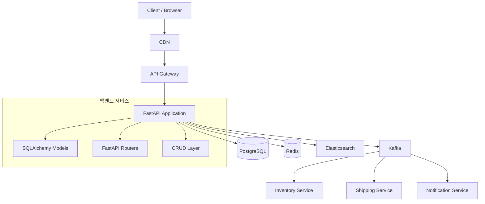

# 대규모 이커머스 시스템 아키텍처 설계 문서

## 1. 프로젝트 개요
본 문서는 reference_docs/ 디렉토리의 SQL 스키마와 코딩 컨벤션을 기반으로 한 대규모 이커머스 시스템의 전체 아키텍처를 정의합니다.  
시스템은 FastAPI 백엔드, PostgreSQL 데이터베이스, Redis 캐시, Kafka 메시지 큐, Elasticsearch 검색 엔진을 사용하는 마이크로서비스 지향 모놀리식 아키텍처를 채택합니다.

## 2. 기술 스택
| 구성 요소 | 기술 선택 |
|-----------|-----------|
| Backend Framework | FastAPI (Python 3.11+) |
| 데이터베이스 | PostgreSQL 15 |
| 캐시 | Redis 7 |
| 메시지 큐 | Apache Kafka |
| 검색 엔진 | Elasticsearch 8 |
| 컨테이너 | Docker, Docker Compose |
| 오케스트레이션 | Kubernetes (선택) |
| 모니터링 | Prometheus, Grafana, ELK |

## 3. 시스템 아키텍처


## 4. 도메인 목록
시스템은 다음과 같이 11개의 핵심 도메인으로 구성됩니다.

| 도메인 | 설명 | 주요 테이블 예시 |
|--------|------|------------------|
| **Product** | 상품 카탈로그 관리 | product, brand, category, sku |
| **User** | 회원 및 인증 관리 | user_account, user_profile, user_auth |
| **Cart** | 장바구니 관리 | cart, cart_item, cart_coupon |
| **Order** | 주문 및 상태 관리 | order_header, order_item, order_status_history |
| **Payment** | 결제 처리 | payment, payment_transaction, payment_method |
| **Inventory** | 재고 관리 및 동시성 제어 | inventory, inventory_reservation |
| **Shipping** | 배송 및 물류 관리 | shipment, shipment_tracking, warehouse |
| **Promotion** | 프로모션 및 쿠폰 관리 | promotion, coupon, coupon_issue |
| **Review** | 상품 리뷰 및 평점 | review, review_rating, review_like |
| **Search** | 검색 및 인덱싱 | search_product_index, search_log |
| **Admin** | 관리자 콘솔 및 권한 관리 | admin_account, admin_role, admin_action_log |

## 5. 디렉토리 구조
```
ecommerce/
├── app/
│   ├── main.py                      # FastAPI 앱 생성 및 라우터 등록
│   ├── database.py                  # SQLAlchemy 설정 및 SessionLocal
│   ├── core/
│   │   ├── config.py                # 환경 변수 및 설정 관리 (Pydantic Settings)
│   │   ├── security.py              # JWT 인증, 비밀번호 해싱
│   │   └── exceptions.py            # 커스텀 예외 처리기
│   ├── models/                      # SQLAlchemy 모델 (DB 테이블)
│   │   ├── __init__.py              # 모든 모델 import
│   │   ├── product.py               # Product 도메인 모델
│   │   ├── user.py                  # User 도메인 모델
│   │   └── ... (나머지 9개 도메인)
│   ├── schemas/                     # Pydantic 모델 (Request/Response 검증)
│   │   ├── __init__.py
│   │   ├── product.py
│   │   ├── user.py
│   │   └── ...
│   ├── routers/                     # API 경로 정의 (Controller)
│   │   ├── __init__.py
│   │   ├── product.py
│   │   ├── user.py
│   │   └── ...
│   ├── crud/                        # DB 직접 조작 로직
│   │   ├── __init__.py
│   │   ├── product.py
│   │   ├── user.py
│   │   └── ...
│   ├── dependencies.py              # 공통 의존성 (get_db 등)
│   └── utils/                       # 공통 유틸리티 함수
├── tests/
│   ├── unit/                        # 단위 테스트
│   ├── integration/                 # 통합 테스트
│   └── conftest.py                  # pytest 픽스처
├── infrastructure/
│   ├── docker/                      # Docker 관련 파일
│   ├── kubernetes/                  # K8s 매니페스트
│   └── terraform/                   # IaC 스크립트
├── scripts/                         # 배포/관리 스크립트
├── reference_docs/                  # 기존 SQL 및 명세 문서
├── Dockerfile                       # 컨테이너 이미지 정의
├── docker-compose.yml               # 로컬 개발 환경
├── requirements.txt                 # Python 패키지 의존성
├── .env                            # 환경 변수 (템플릿)
└── .gitignore
```

## 6. Core 파일 목록
| 파일 경로 | 역할 |
|-----------|------|
| `app/main.py` | FastAPI 앱 인스턴스 생성, 미들웨어 설정, 라우터 등록 |
| `app/database.py` | SQLAlchemy 엔진, 세션 로컬, 베이스 모델 정의 |
| `app/core/config.py` | 환경 변수 로드 (`.env`), Pydantic Settings 클래스 |
| `app/core/security.py` | JWT 토큰 생성/검증, 비밀번호 해싱 (bcrypt) |
| `app/core/exceptions.py` | HTTP 예외 처리기, 커스텀 예외 클래스 |
| `app/dependencies.py` | FastAPI 의존성 함수 (예: `get_db`, `get_current_user`) |
| `app/utils/__init__.py` | 날짜 변환, 금액 포맷 등 공통 유틸리티 |
| `requirements.txt` | 필수 Python 패키지 목록 |
| `.env` | 환경 변수 템플릿 (SECRET_KEY, DATABASE_URL 등) |
| `Dockerfile` | 프로덕션 컨테이너 이미지 정의 |
| `docker-compose.yml` | 로컬 개발을 위한 다중 컨테이너 구성 |
| `alembic/` (선택) | 데이터베이스 마이그레이션 스크립트 |

## 7. 데이터베이스 스키마 개요
모든 테이블은 `ecommerce` 스키마 아래에 생성되며, 각 도메인별로 다음과 같은 핵심 테이블을 포함합니다.

- **Product**: product, brand, category, product_option, sku, product_image
- **User**: user_account, user_profile, user_address, user_auth, user_role
- **Cart**: cart, cart_item, cart_item_option_snapshot
- **Order**: order_header, order_item, order_status_history, order_payment
- **Payment**: payment, payment_transaction, payment_method
- **Inventory**: inventory, inventory_reservation, inventory_transaction
- **Shipping**: shipment, shipment_item, shipment_tracking, warehouse
- **Promotion**: promotion, coupon, coupon_issue, promotion_condition
- **Review**: review, review_rating, review_image, product_review_summary
- **Search**: search_product_index, search_log, search_keyword
- **Admin**: admin_account, admin_role, admin_permission, admin_action_log

자세한 컬럼 정의는 `reference_docs/*.sql` 파일을 참조하십시오.

## 8. API 엔드포인트 예시
| 메서드 | 경로 | 설명 |
|--------|------|------|
| `GET` | `/api/v1/products` | 상품 목록 조회 (필터, 페이징) |
| `POST` | `/api/v1/cart/items` | 장바구니에 상품 추가 |
| `POST` | `/api/v1/orders` | 주문 생성 |
| `POST` | `/api/v1/payments` | 결제 요청 |
| `GET` | `/api/v1/users/me` | 현재 사용자 정보 조회 |
| `PUT` | `/api/v1/inventory/reserve` | 재고 예약 |

## 9. 배포 및 인프라
- **로컬 개발**: `docker-compose up`으로 PostgreSQL, Redis, Kafka, Elasticsearch 컨테이너 실행
- **테스트**: `pytest`를 이용한 단위/통합 테스트, 샌드박스 환경에서 검증
- **CI/CD**: GitHub Actions를 통한 자동 테스트 및 Docker 이미지 빌드
- **프로덕션**: Kubernetes 클러스터에 마이크로서비스로 배포, Auto Scaling 구성
- **모니터링**: Prometheus 메트릭 수집, Grafana 대시보드, ELK 로그 집계

## 10. 확장성 고려사항
- **수평 확장**: Stateless 애플리케이션 레이어, 로드 밸런서 배치
- **데이터 분할**: 샤딩을 통한 사용자/주문 데이터 분산 저장
- **캐싱 전략**: Redis를 이용한 핫 데이터 캐싱 (Cart, 인기 상품)
- **비동기 처리**: Kafka를 통한 주문 처리, 재고 동기화, 알림 발송
- **검색 최적화**: Elasticsearch 인덱싱 및 역정규화된 데이터 구조

---
*본 설계 문서는 reference_docs/ 디렉토리의 SQL 스키마와 코딩 컨벤션을 준수하며, 실제 구현 시 추가적인 상세 설계가 필요할 수 있습니다.*