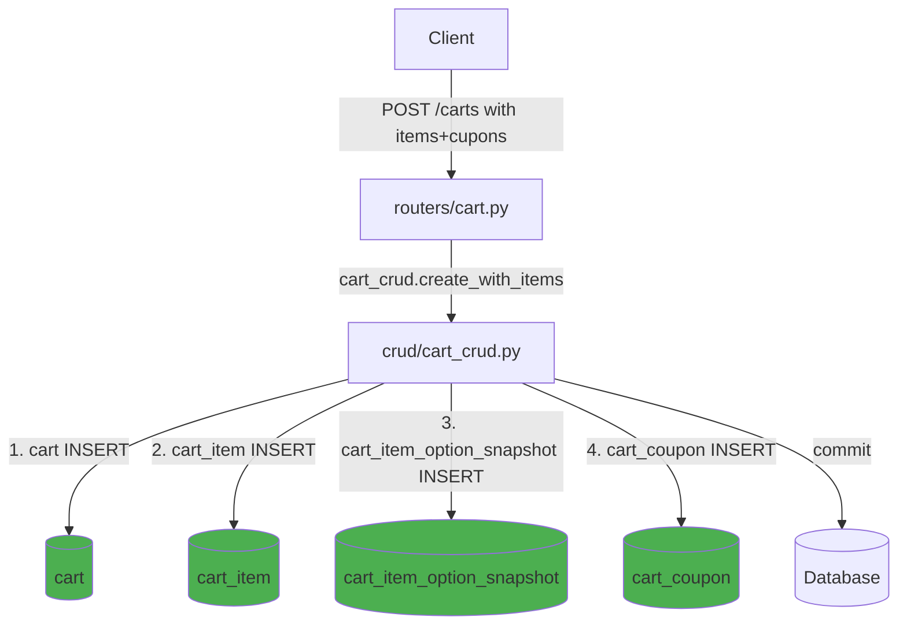

# Cart 복합 생성 API 추가 Plan

## 1. 문제 상황

현재 `POST /carts`는 **cart 테이블만** 생성하고, 나머지 테이블(`cart_item`, `cart_item_option_snapshot`, `cart_coupon`)은 별도 API로 생성해야 함.

```json
// 현재: 3~4번 API 호출 필요
POST /carts                          // cart만 생성
POST /carts/{id}/items               // cart_item 생성 (별도 호출)
POST /items/{id}/option-snapshots    // 옵션 스냅샷 (별도 호출)
POST /carts/{id}/coupons             // 쿠폰 적용 (별도 호출)
```

**Product 도메인**은 하나의 `POST /products`로 4개 테이블을 한 번에 생성함. Cart도 동일한 패턴을 따라야 함.

## 2. 대상 파일

| 파일 | 변경 유형 | 설명 |
|------|:--------:|------|
| `backend/app/schemas/cart.py` | 수정 | `CartItemNestedCreate`, `CartCouponNestedCreate` 스키마 추가, `CartCreate`에 items/coupons 필드 추가 |
| `backend/app/crud/cart_crud.py` | 수정 | `CartCRUD.create_with_items()` 메서드 추가 - Cart + items + coupons를 한 트랜잭션에 생성 |
| `backend/app/routers/cart.py` | 수정 | `create_cart()`에서 nested items/coupons 처리 로직 추가 |
| `backend/tests/unit/test_cart_domain.py` | 수정 | 복합 생성 스키마 및 라우터 테스트 추가 |
| `backend/tests/integration/test_cart_api.py` | 수정 (선택) | 복합 생성 통합 테스트 추가 |

## 3. 상세 작업 목록

### Step 1: Nested Create 스키마 추가

**파일**: [`backend/app/schemas/cart.py`](../backend/app/schemas/cart.py)

Product 도메인의 패턴과 동일하게, **중첩 생성용 스키마**를 추가:

```python
class CartItemNestedCreate(ORMBaseSchema):
    """장바구니 상품 항목 생성 요청 스키마 (nested create 용 - cart_id 제외)."""
    sku_id: int
    quantity: int = Field(..., ge=1)
    unit_price_amount: Decimal = Field(..., max_digits=12, decimal_places=2)
    total_price_amount: Decimal = Field(..., max_digits=12, decimal_places=2)
    is_selected: Optional[bool] = True
    added_at: Optional[datetime] = None
    created_by: Optional[int] = None
    option_snapshots: list[CartItemOptionSnapshotNestedCreate] = Field(default_factory=list)


class CartItemOptionSnapshotNestedCreate(ORMBaseSchema):
    """장바구니 옵션 스냅샷 생성 요청 스키마 (nested create 용 - cart_item_id 제외)."""
    option_name: Optional[str] = Field(default=None, max_length=100)
    option_value: Optional[str] = Field(default=None, max_length=100)


class CartCouponNestedCreate(ORMBaseSchema):
    """장바구니 쿠폰 생성 요청 스키마 (nested create 용 - cart_id 제외)."""
    coupon_id: int
    discount_amount: Optional[Decimal] = Field(default=None, max_digits=12, decimal_places=2)
```

**`CartCreate`에 items/coupons 필드 추가**:

```python
class CartCreate(CartBase):
    """장바구니 생성 요청 스키마 (items, coupons 중첩 생성 지원)."""
    created_by: Optional[int] = None
    items: list[CartItemNestedCreate] = Field(default_factory=list)
    coupons: list[CartCouponNestedCreate] = Field(default_factory=list)
```

Product 패턴 참고:
```python
class ProductCreate(ProductBase):
    category_ids: list[int] = Field(default_factory=list)
    options: list[ProductOptionCreate] = Field(default_factory=list)  # 중첩
    images: list[ProductImageCreate] = Field(default_factory=list)     # 중첩
```

### Step 2: CartCRUD에 create_with_items() 메서드 추가

**파일**: [`backend/app/crud/cart_crud.py`](../backend/app/crud/cart_crud.py)

```python
class CartCRUD(CRUDBase[Cart]):
    def create_with_items(
        self,
        db: Session,
        obj_in: CartCreate,
        *,
        session_id: Optional[str] = None,
    ) -> Cart:
        """장바구니와 함께 items(옵션 스냅샷 포함), coupons를 한 트랜잭션에 생성한다."""
        # 1. Cart 기본 정보 생성
        create_data = obj_in.model_dump(exclude={"items", "coupons"}, exclude_unset=True)
        if session_id is not None:
            create_data["session_id"] = session_id
        cart = Cart(**create_data)
        db.add(cart)
        db.flush()  # cart.id 확보

        # 2. items → cart_item + cart_item_option_snapshot INSERT
        now = datetime.now(timezone.utc).replace(tzinfo=None)
        for item_in in obj_in.items:
            cart_item = CartItem(
                cart_id=cart.id,
                sku_id=item_in.sku_id,
                quantity=item_in.quantity,
                unit_price_amount=item_in.unit_price_amount,
                total_price_amount=item_in.total_price_amount,
                is_selected=item_in.is_selected,
                added_at=item_in.added_at or now,
                created_by=item_in.created_by,
            )
            db.add(cart_item)
            db.flush()  # cart_item.id 확보

            # 2-1. option_snapshots → cart_item_option_snapshot INSERT
            for snap_in in item_in.option_snapshots:
                snapshot = CartItemOptionSnapshot(
                    cart_item_id=cart_item.id,
                    option_name=snap_in.option_name,
                    option_value=snap_in.option_value,
                )
                db.add(snapshot)

        # 3. coupons → cart_coupon INSERT
        for coupon_in in obj_in.coupons:
            coupon = CartCoupon(
                cart_id=cart.id,
                coupon_id=coupon_in.coupon_id,
                discount_amount=coupon_in.discount_amount,
            )
            db.add(coupon)

        db.commit()
        db.refresh(cart)
        return cart
```

### Step 3: Router create_cart 수정

**파일**: [`backend/app/routers/cart.py`](../backend/app/routers/cart.py)

```python
@router.post(
    "/carts",
    response_model=APIResponse[CartRead],
    status_code=status.HTTP_201_CREATED,
    summary="장바구니 생성 (상품/쿠폰 포함)",
)
def create_cart(
    payload: CartCreate,
    request: Request,
    response: Response,
    db: Session = Depends(get_db),
) -> APIResponse[CartRead]:
    """장바구니를 생성한다. items와 coupons를 함께 전달하여 한 번에 생성할 수 있다."""
    session_id = get_session_id(request, response)
    cart = cart_crud.create_with_items(db, payload, session_id=session_id)
    created_cart = _get_cart_or_404(db, cart.id)
    return APIResponse(data=created_cart, message="장바구니를 생성했습니다.")
```

### Step 4: 단위 테스트 업데이트

**파일**: [`backend/tests/unit/test_cart_domain.py`](../backend/tests/unit/test_cart_domain.py)

- `test_cart_create_schema_supports_nested_items` - CartCreate에 items/coupons 중첩 필드 검증
- `test_cart_create_schema_with_items` - items를 포함한 CartCreate 생성 테스트
- `test_cart_item_nested_create_schema` - CartItemNestedCreate 스키마 검증
- `test_cart_coupon_nested_create_schema` - CartCouponNestedCreate 스키마 검증

### Step 5: (선택) 통합 테스트 추가

**파일**: [`backend/tests/integration/test_cart_api.py`](../backend/tests/integration/test_cart_api.py)

- `test_create_cart_with_items_success` - items를 포함한 장바구니 생성
- `test_create_cart_with_items_and_coupons_success` - items + coupons 포함 생성
- `test_create_cart_with_option_snapshots_success` - 옵션 스냅샷 포함 생성

## 4. API 변경 사양

### 요청 (Request)

```json
POST /api/v1/carts
{
    "user_id": null,
    "cart_status": "ACTIVE",
    "created_by": null,
    "items": [
        {
            "sku_id": 100,
            "quantity": 2,
            "unit_price_amount": 15000.00,
            "total_price_amount": 30000.00,
            "is_selected": true,
            "option_snapshots": [
                {"option_name": "색상", "option_value": "블랙"}
            ]
        }
    ],
    "coupons": [
        {
            "coupon_id": 5,
            "discount_amount": 5000.00
        }
    ]
}
```

### 응답 (Response) - 변경 없음

기존 `CartRead` 응답을 그대로 사용 (items/coupons 포함)

## 5. 영향도 분석

| 항목 | 영향 | 비고 |
|------|:----:|------|
| 기존 `POST /carts` 동작 | ✅ 호환성 유지 | `items`, `coupons` 필드는 `default_factory=list`로 기본값이 빈 리스트 |
| 기존 클라이언트 | ✅ 하위 호환 | items/coupons 없는 요청은 기존과 동일하게 cart만 생성됨 |
| `POST /carts/{id}/items` | ✅ 유지 | 별도 추가 API는 계속 사용 가능 |
| `POST /carts/{id}/coupons` | ✅ 유지 | 별도 추가 API는 계속 사용 가능 |

## 6. Mermaid: 변경 후 데이터 흐름


