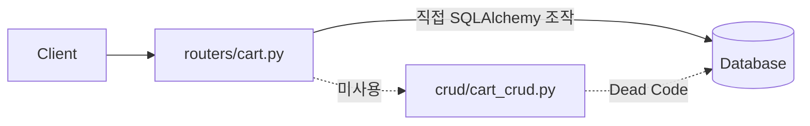
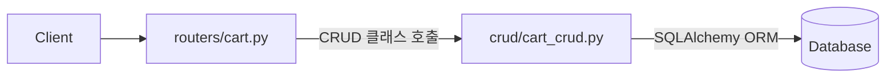

# Cart 도메인 CRUD 리팩토링 Plan

## 1. 현재 상황 분석

### 1.1 Cart 도메인 4개 테이블의 실제 사용 현황

| 테이블 | API 엔드포인트 | 사용 여부 | 비고 |
|--------|---------------|:--------:|------|
| `cart` | `POST /carts` | ✅ 사용 중 | 장바구니 생성 |
| `cart` | `GET /carts` | ✅ 사용 중 | 목록 조회 |
| `cart` | `GET /carts/{id}` | ✅ 사용 중 | 상세 조회 |
| `cart` | `PUT /carts/{id}` | ✅ 사용 중 | 수정 |
| `cart` | `DELETE /carts/{id}` | ✅ 사용 중 | 소프트 삭제 |
| `cart_item` | `POST /carts/{id}/items` | ✅ 사용 중 | 상품 추가 |
| `cart_item` | `PUT /items/{id}` | ✅ 사용 중 | 상품 수정 |
| `cart_item` | `DELETE /items/{id}` | ✅ 사용 중 | 상품 삭제 |
| `cart_item_option_snapshot` | `POST /items/{id}/option-snapshots` | ✅ 사용 중 | 옵션 스냅샷 추가 |
| `cart_coupon` | `POST /carts/{id}/coupons` | ✅ 사용 중 | 쿠폰 적용 |

→ **4개 테이블 모두 API 엔드포인트가 존재하며 정상 사용 가능한 상태**

### 1.2 핵심 문제: CRUD 클래스 Dead Code

[`backend/app/crud/cart_crud.py`](../backend/app/crud/cart_crud.py)에 정의된 4개 CRUD 클래스:

| CRUD 클래스 | 라우터에서 사용 여부 | 상태 |
|-------------|:------------------:|:----:|
| `CartCRUD` | ❌ | Dead Code |
| `CartItemCRUD` | ❌ | Dead Code |
| `CartItemOptionSnapshotCRUD` | ❌ | Dead Code |
| `CartCouponCRUD` | ❌ | Dead Code |

**원인**: [`routers/cart.py`](../backend/app/routers/cart.py)가 CRUD 클래스를 전혀 사용하지 않고, 모든 라우터 함수에서 직접 SQLAlchemy 모델을 인스턴스화 (`Cart(...)`, `db.add()`, `db.commit()`)하고 있음.

### 1.3 프로젝트 전체 패턴 분석 (추가 발견)

```
라우터 파일          CRUD 사용 여부
─────────────────────────────────────
routers/cart.py      ❌ 미사용 ← 현재 대상
routers/product.py   ❌ 미사용
routers/brand.py     ❌ 미사용
routers/category.py  ❌ 미사용
routers/sku.py       ❌ 미사용
```

→ **CRUD 클래스 미사용 문제는 Cart 도메인만의 문제가 아닌, 프로젝트 전반의 Cross-cutting 이슈**

---

## 2. 리팩토링 방안 (2가지 선택지)

### 선택지 A: Cart만 CRUD 패턴으로 전환 (선택됨)

**범위**: Cart 도메인에 한정하여 CRUD 클래스를 라우터에서 사용하도록 개선

**장점**: 사용자가 요청한 범위에 집중, 변경 범위 최소화
**단점**: 다른 도메인과의 일관성은 깨짐 (다른 라우터는 여전히 직접 모델 조작)

### 선택지 B: 프로젝트 전체 CRUD 패턴 통일

**범위**: 모든 도메인의 라우터가 CRUD 클래스를 사용하도록 일괄 리팩토링
**장점**: 전체 아키텍처 일관성 확보
**단점**: 변경 범위가 매우 큼, 별도 Plan 필요

→ **선택지 A로 진행** (사용자 선택)

---

## 3. 상세 작업 목록

### Step 1: `cart_crud.py` CRUD 클래스 리팩토링

**대상 파일**: [`backend/app/crud/cart_crud.py`](../backend/app/crud/cart_crud.py)

**변경 사항**:

1. **`CartCRUD.create()`** - `CartCreate` → `Cart` 객체 생성 로직 추가 기존에는 `create_data = obj_in.model_dump(exclude_unset=True)`로 단순 변환만 했으나, `session_id`를 인자로 받을 수 있도록 개선

2. **`CartItemCRUD.create()`** - `CartItemCreate` → `CartItem` 생성 로직 유지

3. **`CartItemOptionSnapshotCRUD.create()`** - `CartItemOptionSnapshotCreate` → 스냅샷 생성 로직 유지

4. **`CartCouponCRUD.create()`** - `CartCouponCreate` → 쿠폰 생성 로직 유지

5. **기존 CRUD 메서드 유지**: `get()`, `get_multi()`, `update()`, `remove()` 등은 이미 구현되어 있음 → 라우터가 이 메서드들을 호출하도록 변경

### Step 2: `routers/cart.py` - CRUD 클래스 도입

**대상 파일**: [`backend/app/routers/cart.py`](../backend/app/routers/cart.py)

**변경 사항 상세**:

| 현재(직접 조작) | 변경 후(CRUD 사용) |
|----------------|-------------------|
| `cart = Cart(...)` + `db.add()` + `db.commit()` | `cart = cart_crud.create(db, payload, session_id=session_id)` |
| `db.execute(statement).scalar_one_or_none()` | `cart_crud.get(db, cart_id)` |
| `cart.deleted_at = ...` + `db.add()` + `db.commit()` | `cart_crud.remove(db, cart_id)` |
| 직접 setattr 루프 | `cart_crud.update(db, cart, payload)` |
| `cart_item = CartItem(...)` + 직접 조작 | `cart_item_crud.create(db, payload)` |
| 직접 조회 | `cart_item_crud.get(db, item_id)` |
| 직접 소프트 삭제 | `cart_item_crud.remove(db, item_id)` |
| 직접 스냅샷 생성 | `cart_item_option_snapshot_crud.create(db, payload)` |
| 직접 쿠폰 생성 | `cart_coupon_crud.create(db, payload)` |

**관계 로딩 관련**:

`CartCRUD`에 `get_with_relations()` 메서드를 추가하거나, 기존 `get()`에 옵션 파라미터를 추가하여 `selectinload`로 items/coupons/option_snapshots를 함께 로딩할 수 있도록 함.

예:
```python
class CartCRUD(CRUDBase[Cart]):
    def get_with_relations(self, db: Session, cart_id: int) -> Optional[Cart]:
        stmt = (
            select(Cart)
            .options(
                selectinload(Cart.items).selectinload(CartItem.option_snapshots),
                selectinload(Cart.coupons),
            )
            .where(Cart.id == cart_id, Cart.deleted_at.is_(None))
        )
        return db.execute(stmt).scalar_one_or_none()
```

**라우터 구조 변경**:

```python
from app.crud import (
    cart_crud, cart_item_crud, 
    cart_item_option_snapshot_crud, cart_coupon_crud
)

# Helper 함수들도 CRUD 기반으로 변경
def _get_cart_or_404(db: Session, cart_id: int) -> Cart:
    cart = cart_crud.get_with_relations(db, cart_id)
    if cart is None:
        raise HTTPException(...)
    return cart

@router.post("/carts", ...)
def create_cart(...):
    cart = cart_crud.create(db, payload, session_id=session_id)
    created_cart = _get_cart_or_404(db, cart.id)
    return APIResponse(data=created_cart, ...)
```

### Step 3: 단위 테스트 업데이트

**대상 파일**: [`backend/tests/unit/test_cart_domain.py`](../backend/tests/unit/test_cart_domain.py)

**변경 사항**:

- `test_cart_create_schema_validates_required_fields` - `CartCreate`에 `session_id` 필드가 필요하지 않은지 확인 (기존 스키마에는 session_id가 없음 → 라우터에서 생성)

사실 라우터가 `session_id`를 `get_session_id()`로 생성하기 때문에, `CartCreate` 스키마에는 `session_id` 필드가 없습니다. 따라서 CRUD의 `create()` 메서드가 `session_id`를 별도로 받을 수 있도록 하는 것이 중요합니다.

### Step 4: 통합 테스트 보강 (선택 사항)

**대상 파일**: [`backend/tests/integration/test_cart_api.py`](../backend/tests/integration/test_cart_api.py)

CartItem, CartItemOptionSnapshot, CartCoupon에 대한 통합 테스트가 누락되어 있음. CRUD 리팩토링과 별개로 테스트 커버리지 확보 필요.

---

## 4. 변경 파일 목록

| 파일 | 변경 유형 | 설명 |
|------|:--------:|------|
| `backend/app/crud/cart_crud.py` | 수정 | `CartCRUD`에 `session_id` 파라미터 추가, `get_with_relations()` 메서드 추가 |
| `backend/app/routers/cart.py` | 수정 | CRUD 클래스 사용으로 전환, `_get_cart_or_404()` / `_get_cart_item_or_404()` 리팩토링 |
| `backend/tests/unit/test_cart_domain.py` | 수정 | 변경된 CRUD 시그니처에 맞게 테스트 조정 |
| `backend/tests/integration/test_cart_api.py` | 수정 (선택) | CartItem/OptionSnapshot/Coupon 통합 테스트 추가 |

---

## 5. 리스크 및 고려사항

1. **일관성 문제**: Cart만 CRUD 패턴으로 변경 시, 프로젝트 내 다른 라우터(brand, category, sku, product 등)와 패턴이 달라짐. 향후 전체 통일 작업이 필요할 수 있음.

2. **session_id 생성 로직**: 현재 `CartCRUD.create()`는 `CartCreate`를 인자로 받는데, `CartCreate` 스키마에는 `session_id` 필드가 없음 (라우터의 `get_session_id()`에서 생성). 따라서 CRUD 메서드가 `session_id`를 추가 인자로 받거나, 라우터에서 설정 후 전달해야 함.

3. **Relationship 로딩**: 현재 라우터는 `selectinload`를 사용한 복합 쿼리로 관계 데이터를 함께 로딩함. CRUD 클래스에 이 관계 로딩 로직을 포함시켜야 함 (예: `get_with_relations()` 메서드).

---

## 6. Mermaid: 리팩토링 전후 비교

### 리팩토링 전 (현재)


### 리팩토링 후

