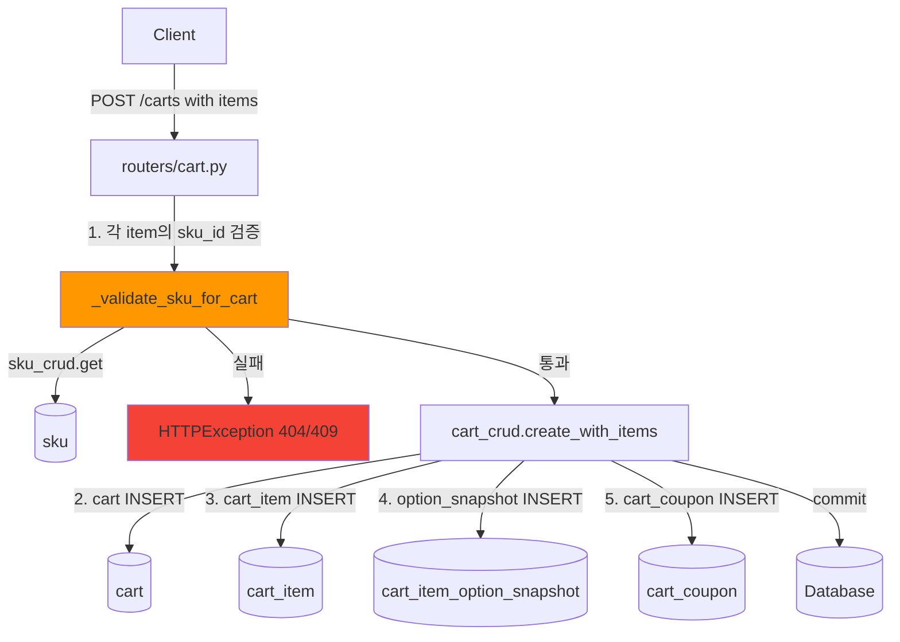

# Cart 복합 생성시 SKU 검증 로직 추가 Plan

## 1. 문제 상황

현재 [`create_with_items()`](backend/app/crud/cart_crud.py:48)는 `sku_id`의 **유효성 검증 없이** 바로 DB에 INSERT한다. 존재하지 않는 `sku_id`가 전달되면 DB ForeignKey 제약조건 위반으로 500 에러가 발생한다.

```json
// 현재 문제: 유효하지 않은 sku_id 입력시
POST /api/v1/carts
{
    "items": [{"sku_id": 99999, "quantity": 1, ...}]  // 존재하지 않는 SKU
}
// 결과: 500 Internal Server Error (ForeignKeyViolation)
```

## 2. 검증 조건

Cart에 상품을 추가할 때 다음 3가지를 검증해야 한다:

| 조건 | 검증 내용 | 실패 시 HTTP 코드 |
|------|-----------|:----------------:|
| **SKU 존재 여부** | `sku_id`가 `sku` 테이블에 존재하는가? | `404 Not Found` |
| **SKU 상태** | 해당 SKU의 `sku_status`가 `ACTIVE`인가? | `409 Conflict` |
| **재고 수량** | `stock_quantity` >= 요청 `quantity`? | `409 Conflict` |

## 3. 대상 파일

| 파일 | 변경 유형 | 설명 |
|------|:--------:|------|
| [`backend/app/routers/cart.py`](backend/app/routers/cart.py) | 수정 | `create_cart()`에 SKU 검증 함수 추가 및 검증 로직 삽입 |
| [`backend/tests/unit/test_cart_domain.py`](backend/app/tests/unit/test_cart_domain.py) | 수정 | SKU 검증 관련 라우터 테스트 추가 (모킹 기반) |
| [`backend/tests/integration/test_cart_api.py`](backend/app/tests/integration/test_cart_api.py) | 수정 | 복합 생성 + SKU 검증 통합 테스트 추가 |

## 4. 상세 작업 목록

### Step 1: Router에 SKU 검증 함수 추가

**파일**: [`backend/app/routers/cart.py`](backend/app/routers/cart.py)

```python
from app.crud import (
    cart_crud,
    cart_item_crud,
    cart_item_option_snapshot_crud,
    cart_coupon_crud,
    sku_crud,  # 추가
)


def _validate_sku_for_cart(
    db: Session,
    sku_id: int,
    quantity: int,
) -> SKU:
    """장바구니 추가 전 SKU의 유효성, 상태, 재고를 검증한다."""
    sku = sku_crud.get(db, sku_id)
    if sku is None:
        raise HTTPException(
            status_code=status.HTTP_404_NOT_FOUND,
            detail=f"SKU(ID={sku_id})를 찾을 수 없습니다.",
        )
    if sku.deleted_at is not None:
        raise HTTPException(
            status_code=status.HTTP_404_NOT_FOUND,
            detail=f"SKU(ID={sku_id})는 삭제된 상품입니다.",
        )
    if sku.sku_status != "ACTIVE":
        raise HTTPException(
            status_code=status.HTTP_409_CONFLICT,
            detail=f"SKU(ID={sku_id})는 현재 판매 중인 상품이 아닙니다. (상태: {sku.sku_status})",
        )
    if sku.stock_quantity < quantity:
        raise HTTPException(
            status_code=status.HTTP_409_CONFLICT,
            detail=f"SKU(ID={sku_id})의 재고가 부족합니다. (요청: {quantity}, 재고: {sku.stock_quantity})",
        )
    return sku
```

### Step 2: `create_cart()`에 검증 로직 삽입

```python
@router.post(
    "/carts",
    response_model=APIResponse[CartRead],
    status_code=status.HTTP_201_CREATED,
    summary="장바구니 생성 (상품/쿠폰 포함)",
)
def create_cart(
    payload: CartCreate,
    request: Request,
    response: Response,
    db: Session = Depends(get_db),
) -> APIResponse[CartRead]:
    """장바구니를 생성한다. items와 coupons를 함께 전달하여 한 번에 생성할 수 있다."""
    # SKU 검증: 모든 item의 sku_id가 유효한지 사전 확인
    for item_in in payload.items:
        _validate_sku_for_cart(db, item_in.sku_id, item_in.quantity)

    session_id = get_session_id(request, response)
    cart = cart_crud.create_with_items(db, payload, session_id=session_id)
    created_cart = _get_cart_or_404(db, cart.id)
    return APIResponse(data=created_cart, message="장바구니를 생성했습니다.")
```

### Step 3: 단위 테스트 추가

**파일**: [`backend/tests/unit/test_cart_domain.py`](backend/app/tests/unit/test_cart_domain.py)

`_validate_sku_for_cart()` 함수에 대한 단위 테스트 추가:

| 테스트 | 설명 |
|--------|------|
| `test_validate_sku_for_cart_valid` | 유효한 SKU → 정상 통과 |
| `test_validate_sku_for_cart_not_found` | 존재하지 않는 SKU → 404 |
| `test_validate_sku_for_cart_deleted` | 삭제된 SKU → 404 |
| `test_validate_sku_for_cart_inactive` | 비활성 SKU → 409 |
| `test_validate_sku_for_cart_insufficient_stock` | 재고 부족 → 409 |

### Step 4: 통합 테스트 추가

**파일**: [`backend/tests/integration/test_cart_api.py`](backend/app/tests/integration/test_cart_api.py)

| 테스트 | 설명 |
|--------|------|
| `test_create_cart_with_invalid_sku` | 존재하지 않는 sku_id로 생성 시 404 |
| `test_create_cart_with_insufficient_stock` | 재고보다 많은 수량으로 생성 시 409 |

## 5. Mermaid: 변경 후 데이터 흐름



## 6. 영향도 분석

| 항목 | 영향 | 비고 |
|------|:----:|------|
| 기존 정상 요청 | ✅ 영향 없음 | 유효한 SKU로 요청 시 기존과 동일하게 동작 |
| 유효하지 않은 SKU | ✅ 개선 | 500 대신 404/409 에러 반환 |
| `add_cart_item` 엔드포인트 | ❌ 영향 없음 | 별도 엔드포인트이므로 해당 API에도 동일 검증 필요시 별도 PR에서 진행 |
| `sku_crud` 의존성 | ✅ 정상 | 이미 `crud/__init__.py`에서 export됨, router에서 import만 추가 |
