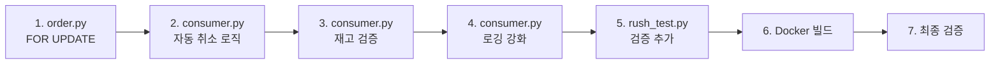

# 재고 소진 시 자동 취소 + Kafka 로깅 구현 계획

## 개요
러시 테스트로 재고가 바닥난 후 주문 자동 취소 로직을 추가하고, Kafka 이벤트 처리 내역을 Docker 로그에 상세 출력

## 변경 파일 목록

### 1. [`backend/app/routers/order.py`](backend/app/routers/order.py) — `SELECT ... FOR UPDATE` 추가

**현재 코드 (라인 150):**
```python
inventory = db.query(Inventory).filter(Inventory.sku_id == item_data.sku_id).first()
```

**변경:**
```python
inventory = (
    db.query(Inventory)
    .with_for_update()
    .filter(Inventory.sku_id == item_data.sku_id)
    .first()
)
```

**효과:** 동시 주문 시 PostgreSQL 행 수준 잠금으로 Race Condition 방지

---

### 2. [`backend/app/events/consumer.py`](backend/app/events/consumer.py) — `handle_order_created` 자동 취소 로직

**현재:** 각 SKU별 InventoryUpdated 발행만 함, 재고 부족 시 아무 조치 없음

**변경 사항:**
- 단일 DB 세션으로 변경 (루프 내 SessionLocal() 제거)
- 각 SKU 재고 조회 후 `available_quantity < 0` (오버부킹) 확인
- 재고 부족 시:
  1. Order 상태 → `CANCELLED`
  2. 재고 롤백 (`_rollback_inventory`)
  3. `PaymentCompleted(FAIL)` 이벤트 발행 (배송 생성 차단)
  4. 상세 로그 출력
- 재고 정상 시: 기존대로 각 SKU별 `InventoryUpdated` 발행

---

### 3. [`backend/app/events/consumer.py`](backend/app/events/consumer.py) — `handle_inventory_updated` 재고 검증

**현재:** 재고 0이어도 Mock PG 결제 성공 처리

**변경 사항:**
- `available_quantity`가 음수인 경우 결제 중단
- Order `CANCELLED` + 재고 롤백
- `PaymentCompleted(FAIL)` 발행
- 상세 로그 출력

---

### 4. [`backend/app/events/consumer.py`](backend/app/events/consumer.py) — 모든 핸들러 상세 로깅

각 핸들러에 다음 로그 추가:
- `[Kafka] Received event: 토픽명 key=xxx` — 이벤트 수신
- `[Kafka] Processing: 핸들러명 - 상세내용` — 처리 시작
- `[Kafka] Completed: 핸들러명 - 결과상태` — 처리 완료
- `[Kafka] Cancelled: 주문ID 사유` — 취소 발생 시
- `[Kafka] Skipped: 주문ID 사유` — 중복/생략 시

---

### 5. [`backend/scripts/order_rush_test.py`](backend/scripts/order_rush_test.py) — 재고 소진 검증

**추가:** 
- 재고 소진 후 409 응답 카운트 출력
- 생성 성공한 주문 수 vs 소진 후 실패한 주문 수 비교
- Kafka 이벤트 발행 여부 검증

---

## 구현 순서



## 예상 Docker 로그 출력 예시

```
[Kafka] Received event: topic=OrderCreated key=42
[Kafka] Processing: handle_order_created - order_id=42 items_count=2
[Kafka]   SKU 1: inventory_id=5 available_qty=10 → after_deduction=9 OK
[Kafka]   SKU 2: inventory_id=8 available_qty=0 → INSUFFICIENT
[Kafka] Cancelled: order_id=42 reason=SKU(ID=8) 재고 부족 (available=0, requested=1)
[Kafka] Completed: handle_order_created - CANCELLED (재고 부족)
[Kafka] Published: topic=PaymentCompleted key=42 status=FAIL
```
