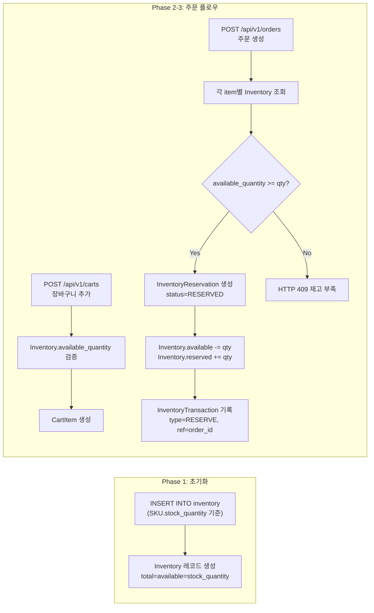

# Inventory 통합 개선 Plan

## 개요
SKU.stock_quantity와 Inventory 도메인 간의 단절을 해결하고, 주문 생성 시 Inventory 예약이 자동으로 이루어지도록 개선한다.

## 대상 파일
| 파일 | 역할 |
|------|------|
| `backend/app/routers/cart.py` | 장바구니 검증 로직 수정 |
| `backend/app/routers/order.py` | 주문 생성 시 Inventory 예약 자동화 |
| `backend/app/routers/inventory.py` | WarehouseStock / Adjustment 라우터 추가 |
| `backend/app/routers/sku.py` | (선택) SKU 생성 시 Inventory 자동 생성 |
| `backend/app/schemas/inventory.py` | (변경 없음, 이미 존재) |
| `backend/tests/unit/test_cart_domain.py` | _validate_sku_for_cart 테스트 업데이트 |
| `backend/tests/unit/test_inventory_domain.py` | 신규 라우터 등록 테스트 추가 |
| `backend/tests/integration/test_order_api.py` | 주문-재고 예약 통합 테스트 추가 |
| `plans/inventory_insert.sql` | Inventory/WarehouseStock 초기 데이터 INSERT SQL |

---

## Phase 1: Inventory 데이터 초기화 (DB 직접 실행)

### Step 1: Inventory 기본 데이터 INSERT

각 SKU의 `stock_quantity` 값을 기준으로 Inventory 레코드를 생성한다.
- `total_quantity` = `SKU.stock_quantity`
- `available_quantity` = `SKU.stock_quantity` (초기에는 예약 0)
- `reserved_quantity` = 0
- `safety_stock_quantity` = 10 (기본값)

```sql
INSERT INTO ecommerce.inventory (sku_id, total_quantity, available_quantity, reserved_quantity, safety_stock_quantity, created_by)
SELECT id, stock_quantity, stock_quantity, 0, 10, 1
FROM ecommerce.sku
WHERE NOT EXISTS (SELECT 1 FROM ecommerce.inventory WHERE sku_id = sku.id);
```

### Step 2: WarehouseStock 초기 데이터 INSERT

단일 가상 창고(warehouse_id=1)에 모든 재고를 할당한다.

```sql
INSERT INTO ecommerce.warehouse_stock (warehouse_id, sku_id, stock_quantity)
SELECT 1, id, stock_quantity
FROM ecommerce.sku
WHERE NOT EXISTS (SELECT 1 FROM ecommerce.warehouse_stock WHERE sku_id = sku.id);
```

---

## Phase 2: 장바구니 검증 변경

### Step 3: `_validate_sku_for_cart()` 수정

**현재**: `SKU.stock_quantity`로 재고 검증
```python
if sku.stock_quantity < quantity:
    raise HTTPException(status_code=409, detail="재고 부족")
```

**변경**: `Inventory.available_quantity`로 재고 검증
```python
inventory = db.execute(
    select(Inventory).where(Inventory.sku_id == sku.id)
).scalar_one_or_none()
if inventory is None:
    raise HTTPException(status_code=409, detail="재고 정보가 없습니다.")
if inventory.available_quantity < quantity:
    raise HTTPException(status_code=409, detail=f"재고 부족 (가용: {inventory.available_quantity})")
```

**변경 필요 import**: `Inventory` 모델 추가

### Step 4: 단위 테스트 업데이트

`TestValidateSkuForCart` 클래스 업데이트:
- `_make_mock_sku` → `_make_mock_sku_and_inventory`로 변경
- Mock Inventory 객체도 함께 생성
- `test_insufficient_stock_raises_409` — Inventory.available_quantity 기준 검증으로 변경

---

## Phase 3: 주문 생성 시 Inventory 예약 자동화

### Step 5: `create_order()` 에서 각 OrderItem별 InventoryReservation 생성

```python
# order.py create_order() 내부, commit() 전에 추가
for item_data in payload.items:
    # 재고 예약 생성
    inventory = db.execute(
        select(Inventory).where(Inventory.sku_id == item_data.sku_id)
    ).scalar_one_or_none()
    
    if inventory is None:
        raise HTTPException(status_code=409,
            detail=f"SKU(ID={item_data.sku_id})의 재고 정보가 없습니다.")
    if inventory.available_quantity < item_data.quantity:
        raise HTTPException(status_code=409,
            detail=f"SKU(ID={item_data.sku_id}) 재고 부족")
    
    reservation = InventoryReservation(
        sku_id=item_data.sku_id,
        order_id=order.id,  # db.flush()로 확보된 order.id
        reserved_quantity=item_data.quantity,
        reservation_status="RESERVED",
    )
    db.add(reservation)
    
    # Inventory 수량 업데이트
    inventory.available_quantity -= item_data.quantity
    inventory.reserved_quantity += item_data.quantity
    inventory.updated_at = datetime.now(timezone.utc).replace(tzinfo=None)
    db.add(inventory)
```

### Step 6: InventoryTransaction 기록

```python
    transaction = InventoryTransaction(
        sku_id=item_data.sku_id,
        transaction_type="RESERVE",
        quantity=item_data.quantity,
        reference_type="ORDER",
        reference_id=order.id,
    )
    db.add(transaction)
```

### Step 7: 필요한 Import 추가

```python
from app.models.inventory import Inventory, InventoryReservation, InventoryTransaction
```

---

## Phase 4: WarehouseStock / InventoryAdjustment Router 추가

### Step 8: WarehouseStock CRUD 라우터 (`inventory.py`)

```python
@router.post(
    "/warehouse-stocks",
    response_model=APIResponse[WarehouseStockRead],
    status_code=status.HTTP_201_CREATED,
    summary="창고 재고 생성",
)
def create_warehouse_stock(payload: WarehouseStockCreate, db: Session = Depends(get_db)):
    """창고 재고를 생성한다."""
    inventory = db.execute(
        select(Inventory).where(Inventory.sku_id == payload.sku_id)
    ).scalar_one_or_none()
    if inventory is None:
        raise HTTPException(status_code=404, detail="해당 SKU의 재고 정보가 없습니다.")
    
    wh_stock = WarehouseStock(**payload.model_dump())
    db.add(wh_stock)
    db.commit()
    db.refresh(wh_stock)
    return APIResponse(data=wh_stock, message="창고 재고를 생성했습니다.")

@router.get(
    "/warehouse-stocks",
    response_model=APIResponse[list[WarehouseStockRead]],
    summary="창고 재고 목록 조회",
)
def list_warehouse_stocks(
    skip: int = Query(0, ge=0),
    limit: int = Query(20, ge=1, le=100),
    sku_id: Optional[int] = Query(default=None, gt=0),
    db: Session = Depends(get_db),
):
    stmt = select(WarehouseStock).options(selectinload(WarehouseStock.inventory))
    if sku_id is not None:
        stmt = stmt.where(WarehouseStock.sku_id == sku_id)
    stmt = stmt.offset(skip).limit(limit)
    stocks = db.execute(stmt).scalars().unique().all()
    return APIResponse(data=stocks, message="창고 재고 목록을 조회했습니다.")
```

### Step 9: InventoryAdjustment CRUD 라우터 (`inventory.py`)

```python
@router.post(
    "/adjustments",
    response_model=APIResponse[InventoryAdjustmentRead],
    status_code=status.HTTP_201_CREATED,
    summary="재고 조정",
)
def create_adjustment(payload: InventoryAdjustmentCreate, db: Session = Depends(get_db)):
    """재고를 조정하고 이력을 기록한다."""
    inventory = db.execute(
        select(Inventory).where(Inventory.sku_id == payload.sku_id)
    ).scalar_one_or_none()
    if inventory is None:
        raise HTTPException(status_code=404, detail="해당 SKU의 재고 정보가 없습니다.")
    
    # 재고 조정
    inventory.total_quantity += payload.adjustment_quantity
    inventory.available_quantity += payload.adjustment_quantity
    if inventory.available_quantity < 0:
        inventory.available_quantity = 0
    inventory.updated_at = datetime.now(timezone.utc)
    db.add(inventory)
    
    # 조정 이력
    adjustment = InventoryAdjustment(**payload.model_dump())
    db.add(adjustment)
    
    db.commit()
    db.refresh(adjustment)
    return APIResponse(data=adjustment, message="재고를 조정했습니다.")
```

---

## Phase 5: 테스트

### Step 10: 단위 테스트 업데이트
- `test_inventory_domain.py`에 새 라우터 등록 테스트 추가
- `test_cart_domain.py`의 `TestValidateSkuForCart` 업데이트

### Step 11: 통합 테스트 추가 (Cart → Order → Inventory)
- Cart 생성 → Order 생성 → InventoryReservation 존재 확인
- Inventory.available_quantity 차감 확인
- InventoryTransaction 기록 확인

### Step 12: 전체 테스트 실행

---

## Phase 6: 주문 취소 시 재고 복원 (향후)

```python
# order.py - 주문 상태가 CANCELLED로 변경될 때
for reservation in order.inventory_reservations:
    reservation.reservation_status = "RELEASED"
    inventory = reservation.inventory
    inventory.available_quantity += reservation.reserved_quantity
    inventory.reserved_quantity -= reservation.reserved_quantity
    
    transaction = InventoryTransaction(
        sku_id=reservation.sku_id,
        transaction_type="RELEASE",
        quantity=reservation.reserved_quantity,
        reference_type="ORDER",
        reference_id=order.id,
    )
    db.add(transaction)
```

---

## 데이터 흐름 (변경 후)



---

## 실행 순서 요약

| 순서 | 작업 | 담당 |
|------|------|------|
| 1 | `inventory_insert.sql` 실행 (Phase 1) | DB 직접 실행 |
| 2 | `cart.py` _validate_sku_for_cart 수정 (Phase 2) | Code |
| 3 | `test_cart_domain.py` 테스트 업데이트 | Code |
| 4 | `order.py` create_order에 InventoryReservation/Transaction 추가 (Phase 3) | Code |
| 5 | `inventory.py` WarehouseStock/Adjustment 라우터 추가 (Phase 4) | Code |
| 6 | `test_inventory_domain.py` 단위 테스트 업데이트 | Code |
| 7 | `test_order_api.py` 통합 테스트 추가 | Code |
| 8 | 전체 테스트 실행 및 검증 | Code |
