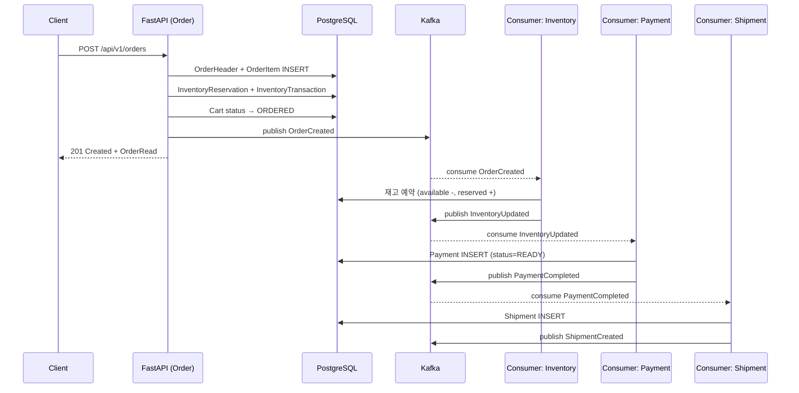
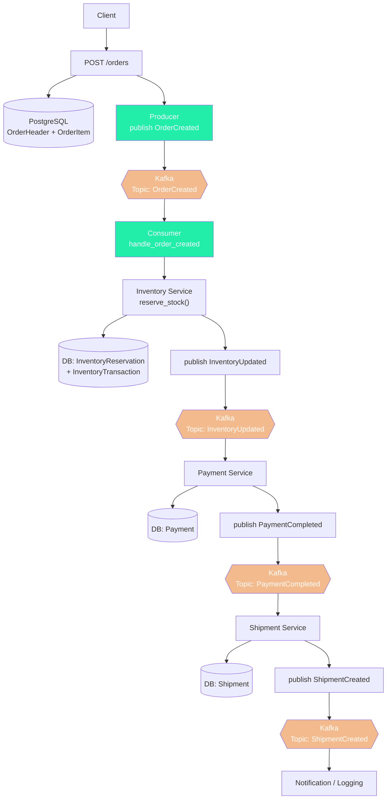
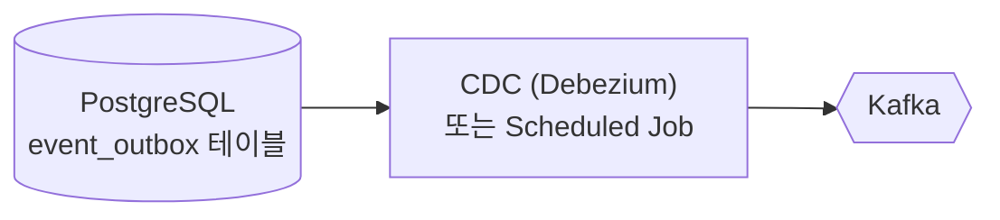

# Kafka Event-Driven Architecture 적용 계획

## 1. 개요

현재 시스템은 모든 주문/재고/결제/배송 로직이 **동기식 REST**로 처리되고 있습니다. 설계 문서([`reference_docs/coding_convention.md`](reference_docs/coding_convention.md))는 **Kafka 기반 이벤트 드리븐 아키텍처**를 요구합니다.

### 목표

- `aiokafka`를 사용한 비동기 이벤트 발행/구독
- 장애 대응: Retry + DLQ + Idempotency
- 현재 동기식 CRUD를 유지하면서 **선택적 이벤트 발행** 추가 (단계적 전환)

---

## 2. 이벤트 흐름 (변경 후)



---

## 3. 파일 변경/생성 목록

| # | 파일 | 작업 | 설명 |
|---|------|------|------|
| 1 | [`requirements.txt`](backend/requirements.txt) | **수정** | `aiokafka` 추가 |
| 2 | [`backend/app/events/__init__.py`](backend/app/events/__init__.py) | **생성** | 이벤트 모듈 초기화 |
| 3 | [`backend/app/events/schemas.py`](backend/app/events/schemas.py) | **생성** | Pydantic 이벤트 스키마 |
| 4 | [`backend/app/events/producer.py`](backend/app/events/producer.py) | **생성** | Kafka Producer (aiokafka) |
| 5 | [`backend/app/events/consumer.py`](backend/app/events/consumer.py) | **생성** | Kafka Consumer + 핸들러 |
| 6 | [`backend/app/core/config.py`](backend/app/core/config.py) | **수정** | Kafka 관련 설정 추가 |
| 7 | [`backend/app/main.py`](backend/app/main.py) | **수정** | lifespan에 Consumer 시작/종료 |
| 8 | [`backend/app/routers/order.py`](backend/app/routers/order.py) | **수정** | OrderCreated 이벤트 발행 |
| 9 | [`backend/app/routers/inventory.py`](backend/app/routers/inventory.py) | **수정** | InventoryUpdated 이벤트 발행 |
| 10 | [`backend/app/routers/payment.py`](backend/app/routers/payment.py) | **수정** | (Consumer 핸들러에서 호출) |
| 11 | [`backend/app/routers/shipment.py`](backend/app/routers/shipment.py) | **수정** | (Consumer 핸들러에서 호출) |
| 12 | 새 테스트 파일들 | **생성** | 이벤트/Consumer 단위 테스트 |

---

## 4. 상세 구현

### Phase 1: 인프라 설정 (의존성 + 설정)

#### Step 1: `requirements.txt` — `aiokafka` 추가

```
aiokafka==0.12.0
```

#### Step 2: [`backend/app/core/config.py`](backend/app/core/config.py) — Kafka 설정 확장

```python
# config.py에 추가
KAFKA_BOOTSTRAP_SERVERS: str = "kafka:9092"
KAFKA_CONSUMER_GROUP_ID: str = "ecommerce-consumer-group"
KAFKA_AUTO_OFFSET_RESET: str = "earliest"
KAFKA_ENABLE_AUTO_COMMIT: bool = False  # 수동 commit
```

#### Step 3: [`backend/app/events/__init__.py`](backend/app/events/__init__.py) 모듈 생성

```python
"""Kafka 이벤트 발행/구독 모듈."""
```

#### Step 4: [`backend/app/events/schemas.py`](backend/app/events/schemas.py) — 이벤트 스키마 정의

```python
from __future__ import annotations
from datetime import datetime
from typing import Optional
from pydantic import BaseModel, Field


class OrderCreatedEvent(BaseModel):
    """주문 생성 이벤트 (§4 OrderCreated)."""
    event_name: str = "OrderCreated"
    event_version: str = "1.0"
    occurred_at: datetime = Field(default_factory=datetime.utcnow)
    
    order_id: int
    user_id: int
    total_pay_amount: int
    items: list[OrderItemEvent]


class OrderItemEvent(BaseModel):
    sku_id: int
    product_name: str
    quantity: int
    unit_price_amount: int


class InventoryUpdatedEvent(BaseModel):
    """재고 변동 이벤트."""
    event_name: str = "InventoryUpdated"
    event_version: str = "1.0"
    occurred_at: datetime = Field(default_factory=datetime.utcnow)

    sku_id: int
    available_quantity: int
    reserved_quantity: int
    order_id: int


class PaymentCompletedEvent(BaseModel):
    """결제 완료 이벤트."""
    event_name: str = "PaymentCompleted"
    event_version: str = "1.0"
    occurred_at: datetime = Field(default_factory=datetime.utcnow)

    order_id: int
    payment_id: int
    status: str  # "SUCCESS" | "FAIL"


class ShipmentCreatedEvent(BaseModel):
    """배송 생성 이벤트."""
    event_name: str = "ShipmentCreated"
    event_version: str = "1.0"
    occurred_at: datetime = Field(default_factory=datetime.utcnow)

    shipment_id: int
    order_id: int
    warehouse_id: int
```

---

### Phase 2: Producer 계층

#### Step 5: [`backend/app/events/producer.py`](backend/app/events/producer.py)

```python
from __future__ import annotations
import json
import logging
from typing import Optional

from aiokafka import AIOKafkaProducer

from app.core.config import settings

logger = logging.getLogger(__name__)

TOPIC_ORDER_CREATED = "OrderCreated"
TOPIC_INVENTORY_UPDATED = "InventoryUpdated"
TOPIC_PAYMENT_COMPLETED = "PaymentCompleted"
TOPIC_SHIPMENT_CREATED = "ShipmentCreated"


_producer: Optional[AIOKafkaProducer] = None


async def get_producer() -> AIOKafkaProducer:
    """Kafka Producer 싱글톤 인스턴스를 반환한다."""
    global _producer
    if _producer is None:
        _producer = AIOKafkaProducer(
            bootstrap_servers=settings.KAFKA_BOOTSTRAP_SERVERS,
            value_serializer=lambda v: json.dumps(v, default=str).encode("utf-8"),
            key_serializer=lambda k: str(k).encode("utf-8"),
        )
        await _producer.start()
    return _producer


async def publish_event(
    topic: str,
    key: str,
    event: BaseModel,
) -> bool:
    """Kafka 토픽에 이벤트를 발행한다."""
    try:
        producer = await get_producer()
        await producer.send(
            topic=topic,
            key=key,
            value=event.model_dump(mode="json"),
        )
        logger.info("Event published: topic=%s key=%s", topic, key)
        return True
    except Exception as exc:
        logger.error("Failed to publish event: topic=%s key=%s error=%s", topic, key, exc)
        # 실패 시 로그만 남기고 DB 트랜잭션은 유지 (나중에 배치 보정)
        return False


async def stop_producer() -> None:
    """Producer를 정리한다."""
    global _producer
    if _producer is not None:
        await _producer.stop()
        _producer = None
```

**핵심 설계 결정**: Producer 실패는 DB 트랜잭션을 롤백시키지 않음. 이벤트 발행 실패 시 로그만 남기고 추후 **배치 보정**(Scheduler)으로 재발행. 이는 `create_order()`의 DB 트랜잭션과 Kafka 발행 간 원자성을 보장하기 위한 **Outbox Pattern** 도입 전 과도기적 접근.

---

### Phase 3: Consumer 계층

#### Step 6: [`backend/app/events/consumer.py`](backend/app/events/consumer.py)

```python
from __future__ import annotations
import asyncio
import json
import logging
from typing import Awaitable, Callable

from aiokafka import AIOKafkaConsumer

from app.core.config import settings
from app.database import SessionLocal
from app.events.schemas import (
    InventoryUpdatedEvent,
    OrderCreatedEvent,
    PaymentCompletedEvent,
    ShipmentCreatedEvent,
)
from app.events.producer import (
    TOPIC_INVENTORY_UPDATED,
    TOPIC_ORDER_CREATED,
    TOPIC_PAYMENT_COMPLETED,
    TOPIC_SHIPMENT_CREATED,
    publish_event,
)

logger = logging.getLogger(__name__)


async def handle_order_created(message_value: dict) -> None:
    """OrderCreated 이벤트 처리 → 재고 예약."""
    event = OrderCreatedEvent(**message_value)
    logger.info("Handling OrderCreated: order_id=%s", event.order_id)
    
    # TODO: Inventory 서비스 호출 (재고 예약)
    # await inventory_service.reserve_stock(event.order_id, event.items)
    
    # InventoryUpdated 이벤트 발행
    for item in event.items:
        await publish_event(
            topic=TOPIC_INVENTORY_UPDATED,
            key=str(item.sku_id),
            value=InventoryUpdatedEvent(
                sku_id=item.sku_id,
                available_quantity=0,  # 실제 조회 필요
                reserved_quantity=item.quantity,
                order_id=event.order_id,
            ),
        )


async def handle_inventory_updated(message_value: dict) -> None:
    """InventoryUpdated 이벤트 처리 → 결제 진행."""
    event = InventoryUpdatedEvent(**message_value)
    logger.info("Handling InventoryUpdated: order_id=%s", event.order_id)
    
    # TODO: Payment 서비스 호출
    # payment = await payment_service.process_payment(event.order_id)
    
    # PaymentCompleted 이벤트 발행
    # await publish_event(
    #     topic=TOPIC_PAYMENT_COMPLETED,
    #     key=str(event.order_id),
    #     value=PaymentCompletedEvent(...),
    # )


async def handle_payment_completed(message_value: dict) -> None:
    """PaymentCompleted 이벤트 처리 → 배송 생성."""
    event = PaymentCompletedEvent(**message_value)
    logger.info("Handling PaymentCompleted: order_id=%s", event.order_id)
    
    # TODO: Shipment 서비스 호출
    # shipment = await shipment_service.create_shipment(event.order_id)
    
    # ShipmentCreated 이벤트 발행
    # await publish_event(
    #     topic=TOPIC_SHIPMENT_CREATED,
    #     key=str(event.order_id),
    #     value=ShipmentCreatedEvent(...),
    # )


async def handle_shipment_created(message_value: dict) -> None:
    """ShipmentCreated 이벤트 처리 (로깅/알림 등)."""
    event = ShipmentCreatedEvent(**message_value)
    logger.info("Handling ShipmentCreated: shipment_id=%s", event.shipment_id)


# 토픽별 핸들러 매핑
HANDLERS: dict[str, Callable[[dict], Awaitable[None]]] = {
    TOPIC_ORDER_CREATED: handle_order_created,
    TOPIC_INVENTORY_UPDATED: handle_inventory_updated,
    TOPIC_PAYMENT_COMPLETED: handle_payment_completed,
    TOPIC_SHIPMENT_CREATED: handle_shipment_created,
}


async def consume_loop() -> None:
    """Kafka Consumer 메인 루프. (lifespan에서 실행)"""
    consumer = AIOKafkaConsumer(
        *HANDLERS.keys(),
        bootstrap_servers=settings.KAFKA_BOOTSTRAP_SERVERS,
        group_id=settings.KAFKA_CONSUMER_GROUP_ID,
        auto_offset_reset=settings.KAFKA_AUTO_OFFSET_RESET,
        enable_auto_commit=settings.KAFKA_ENABLE_AUTO_COMMIT,
        value_deserializer=lambda v: json.loads(v.decode("utf-8")),
        key_deserializer=lambda k: k.decode("utf-8") if k else None,
    )
    await consumer.start()
    try:
        async for msg in consumer:
            handler = HANDLERS.get(msg.topic)
            if handler:
                try:
                    await handler(msg.value)
                    # 수동 commit
                    await consumer.commit()
                except Exception as exc:
                    logger.error(
                        "Handler failed: topic=%s key=%s error=%s",
                        msg.topic, msg.key, exc,
                    )
                    # TODO: DLQ 발행 로직
            else:
                logger.warning("No handler for topic: %s", msg.topic)
    finally:
        await consumer.stop()
```

---

### Phase 4: 애플리케이션 통합

#### Step 7: [`backend/app/main.py`](backend/app/main.py) — lifespan에 Consumer 시작/종료

```python
from contextlib import asynccontextmanager
import asyncio
import logging

from fastapi import FastAPI

from app.events.consumer import consume_loop
from app.events.producer import stop_producer

logger = logging.getLogger(__name__)


@asynccontextmanager
async def lifespan(_: FastAPI):
    """애플리케이션 시작/종료 시 공통 리소스를 관리한다."""
    if settings.AUTO_CREATE_TABLES:
        Base.metadata.create_all(bind=engine)
    
    # Kafka Consumer 백그라운드 태스크 시작
    consumer_task = asyncio.create_task(consume_loop())
    logger.info("Kafka consumer started")
    
    yield
    
    # Consumer 종료
    consumer_task.cancel()
    try:
        await consumer_task
    except asyncio.CancelledError:
        pass
    
    await stop_producer()
    logger.info("Kafka producer stopped")
```

#### Step 8: [`backend/app/routers/order.py`](backend/app/routers/order.py) — OrderCreated 발행

```python
# create_order() 함수末尾 (db.commit() 이후)
@router.post("", ...)
def create_order(payload: OrderCreate, db: Session = Depends(get_db)) -> APIResponse[OrderRead]:
    # ... 기존 주문 생성 로직 ...
    
    db.commit()
    db.refresh(order)
    
    created_order = _get_order_or_404(db, order.id)
    
    # === Kafka: OrderCreated 이벤트 발행 (비동기 fire-and-forget) ===
    try:
        # 비동기 실행을 위해 백그라운드 태스크 사용
        BackgroundTask(publish_event_sync, TOPIC_ORDER_CREATED, str(order.id), {
            "order_id": order.id,
            "user_id": order.user_id,
            "total_pay_amount": order.total_pay_amount,
            "items": [
                {
                    "sku_id": item.sku_id,
                    "product_name": item.product_name,
                    "quantity": item.quantity,
                    "unit_price_amount": item.unit_price_amount,
                }
                for item in order.items
            ],
        })
    except Exception:
        logger.exception("Failed to publish OrderCreated event")
    # ===============================================================
    
    return APIResponse(data=created_order, message="주문을 생성했습니다.")
```

> **참고**: FastAPI `BackgroundTask`를 사용하여 Kafka 발행을 동기 엔드포인트에서 비동기로 실행.

---

### Phase 5: Retry + DLQ + Idempotency

#### Step 9: [`backend/app/events/retry.py`](backend/app/events/retry.py)

```python
"""Retry + Dead Letter Queue + Idempotency 처리."""

import asyncio
import logging
from datetime import datetime, timedelta
from typing import Any, Optional

logger = logging.getLogger(__name__)

# 간단한 In-Memory 멱등성 키 저장소 (실제 환경에서는 Redis)
_idempotency_store: dict[str, datetime] = {}

RETRY_TOPIC_SUFFIX = ".retry"
DLQ_TOPIC_SUFFIX = ".dlq"
MAX_RETRIES = 3
RETRY_DELAY_SECONDS = 5


def is_duplicate(event_id: str) -> bool:
    """멱등성 키 기반 중복 체크."""
    if event_id in _idempotency_store:
        return True
    _idempotency_store[event_id] = datetime.utcnow()
    return False


async def publish_to_dlq(topic: str, message: dict[str, Any], error: str) -> None:
    """실패한 메시지를 DLQ로 발행."""
    dlq_message = {
        "original_topic": topic,
        "original_message": message,
        "error": error,
        "failed_at": datetime.utcnow().isoformat(),
    }
    dlq_topic = f"{topic}{DLQ_TOPIC_SUFFIX}"
    # TODO: DLQ Producer 발행 로직
    logger.warning("Message sent to DLQ: topic=%s", dlq_topic)
```

---

## 5. 데이터 흐름 다이어그램 (변경 후)



---

## 6. 단계별 실행 순서 (Todo)

### Phase 1: 기반 인프라
- [ ] Step 1: `requirements.txt`에 `aiokafka==0.12.0` 추가
- [ ] Step 2: `config.py`에 Kafka Consumer 설정 추가
- [ ] Step 3: `app/events/` 디렉토리 및 `__init__.py` 생성

### Phase 2: 이벤트 스키마
- [ ] Step 4: `app/events/schemas.py` — 4개 이벤트 Pydantic 모델 정의
- [ ] Step 5: 각 이벤트별 단위 테스트 작성

### Phase 3: Producer
- [ ] Step 6: `app/events/producer.py` — AIOKafkaProducer 싱글톤 + `publish_event()`
- [ ] Step 7: Producer 단위 테스트 (Mock Kafka)

### Phase 4: Consumer
- [ ] Step 8: `app/events/consumer.py` — 4개 핸들러 + consume_loop
- [ ] Step 9: Consumer 단위 테스트 (Mock Kafka)

### Phase 5: 애플리케이션 통합
- [ ] Step 10: `main.py` lifespan — Consumer 백그라운드 태스크 시작/종료
- [ ] Step 11: `routers/order.py` — `create_order()`에 OrderCreated 발행 추가
- [ ] Step 12: `routers/inventory.py` — 재고 변동 시 InventoryUpdated 발행
- [ ] Step 13: Consumer 핸들러에 실제 비즈니스 로직 연결 (Inventory → Payment → Shipment)

### Phase 6: 안정성
- [ ] Step 14: `app/events/retry.py` — Retry + DLQ + Idempotency
- [ ] Step 15: 통합 테스트 (Kafka Testcontainers 또는 Mock)

### Phase 7: Search 파이프라인
- [ ] Step 16: Search 도메인에 DB → Kafka → Elasticsearch 파이프라인 적용
- [ ] Step 17: Search 인덱싱 Consumer 구현

---

## 7. 영향도 분석

### 변경 영향

| 도메인 | 변경 내용 | 영향 |
|--------|----------|------|
| **Order** | `create_order()`에 이벤트 발행 코드 추가 | 낮음 (기존 로직 유지, 발행만 추가) |
| **Inventory** | Consumer 핸들러에서 재고 예약 로직 재사용 | 중간 (기존 CRUD 재사용) |
| **Payment** | Consumer 핸들러에서 결제 로직 호출 | 중간 |
| **Shipment** | Consumer 핸들러에서 배송 생성 로직 호출 | 중간 |
| **Search** | DB → Kafka → ES 파이프라인 | 높음 (새 파이프라인) |
| **Main** | lifespan 수정 | 낮음 (Consumer 시작/종료만 추가) |

### 위험 요소

1. **DB ↔ Kafka 원자성**: 현재는 fire-and-forget 방식. Outbox Pattern 도입 전까지 이벤트 유실 가능성 있음
2. **Consumer 장애**: Consumer가 다운되면 이벤트가 backlog에 쌓임. 재시작 시 `earliest`로 복구
3. **중복 처리**: 멱등성 키로 방어하나, In-Memory store이므로 Consumer 재시작 시 초기화됨 (Redis 필요)
4. **테스트**: Kafka 의존성으로 인해 통합 테스트 복잡도 증가

---

## 8. Outbox Pattern (향후 고려)

현재 Phase에서는 **Fire-and-Forget** 방식으로 Producer 실패 시 로그만 남깁니다. 향후 **Transactional Outbox** 도입 시:



- 동일 DB 트랜잭션 내에 `event_outbox` 테이블에 이벤트 INSERT
- 별도 프로세스가 outbox 테이블 폴링하여 Kafka 발행
- DB 트랜잭션과 Kafka 발행 간 **완벽한 원자성** 보장
