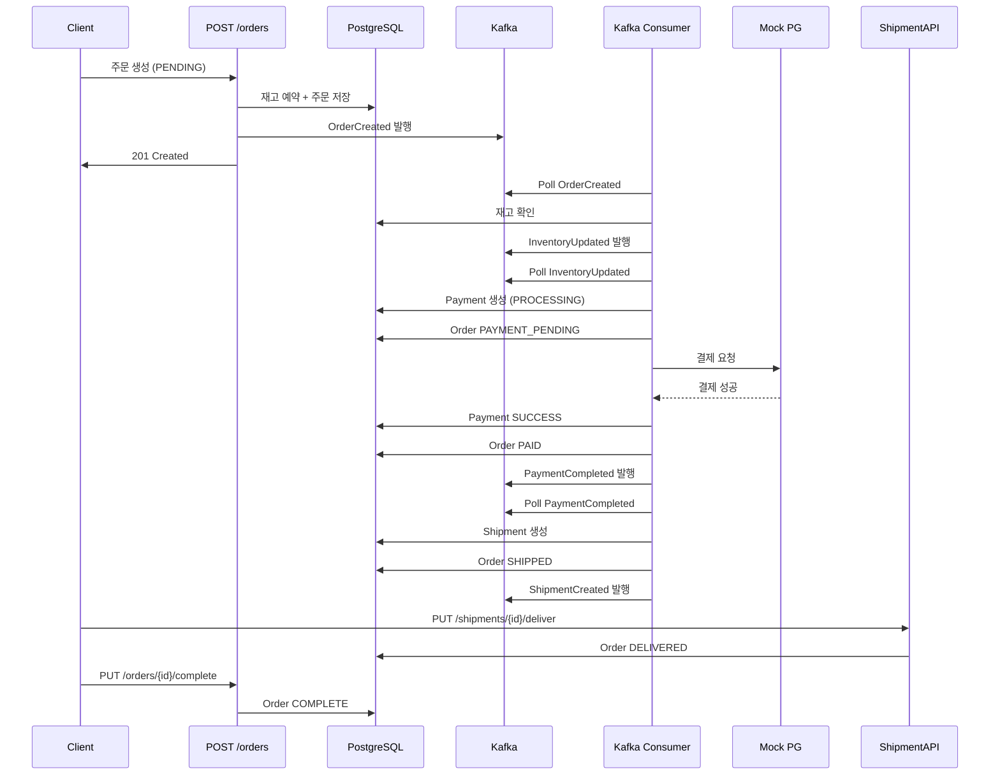

# 주문 상태 머신 구현 계획: PENDING → COMPLETE

## 개요

현재 주문은 `PENDING` 상태로 생성된 후 Kafka Consumer 핸들러가 모두 `# TODO` 주석 처리되어 상태 전이가 멈춰 있다. 이 문서는 Kafka 이벤트 기반으로 `PENDING` → `COMPLETE` 상태 전이를 구현하는 상세 계획을 정의한다.

---

## Phase 0: Order 상태 상수 정의

### 변경 파일: [`backend/app/core/enums.py`](backend/app/core/enums.py) (신규 생성)

```python
# backend/app/core/enums.py
from __future__ import annotations


class OrderStatus:
    """주문 상태 상수."""
    PENDING = "PENDING"        # 주문 생성, 결제 대기
    PAYMENT_PENDING = "PAYMENT_PENDING"  # 결제 진행 중
    PAID = "PAID"              # 결제 완료
    SHIPPING = "SHIPPING"      # 배송 준비 중
    SHIPPED = "SHIPPED"        # 배송 중
    DELIVERED = "DELIVERED"    # 배송 완료
    COMPLETE = "COMPLETE"      # 구매 확정
    CANCELLED = "CANCELLED"    # 주문 취소
    REFUNDED = "REFUNDED"      # 환불 완료

    # 유효 상태 전이 맵: 현재 상태 → 가능한 다음 상태 목록
    TRANSITIONS: dict[str, list[str]] = {
        PENDING: [PAYMENT_PENDING, CANCELLED],
        PAYMENT_PENDING: [PAID, CANCELLED],
        PAID: [SHIPPING, CANCELLED],
        SHIPPING: [SHIPPED, CANCELLED],
        SHIPPED: [DELIVERED],
        DELIVERED: [COMPLETE, REFUNDED],
        COMPLETE: [],
        CANCELLED: [],
        REFUNDED: [],
    }

    @classmethod
    def is_valid_transition(cls, current: str, next_status: str) -> bool:
        return next_status in cls.TRANSITIONS.get(current, [])


class PaymentStatus:
    """결제 상태 상수."""
    PENDING = "PENDING"
    PROCESSING = "PROCESSING"
    SUCCESS = "SUCCESS"
    FAIL = "FAIL"
    CANCELLED = "CANCELLED"
    REFUNDED = "REFUNDED"


class ShipmentStatus:
    """배송 상태 상수."""
    PENDING = "PENDING"
    PACKING = "PACKING"
    SHIPPED = "SHIPPED"
    DELIVERED = "DELIVERED"
    RETURNED = "RETURNED"
    CANCELLED = "CANCELLED"
```

### 변경 파일: [`backend/app/events/schemas.py`](backend/app/events/schemas.py)

`OrderCreatedEvent`에 `order_status` 필드 추가:

```python
class OrderCreatedEvent(BaseModel):
    event_name: str = "OrderCreated"
    event_version: str = "1.0"
    occurred_at: datetime = Field(default_factory=datetime.utcnow)

    order_id: int
    user_id: int
    total_pay_amount: int
    order_status: str = "PENDING"  # <-- 추가
    items: list[OrderItemEvent]
```

---

## Phase 1: 공통 상태 변경 유틸리티

### 변경 파일: [`backend/app/events/consumer.py`](backend/app/events/consumer.py)

모든 Consumer 핸들러에서 공통으로 사용할 DB 세션 관리 및 Order 상태 변경 유틸리티 추가:

```python
# consumer.py 상단에 추가
from app.database import SessionLocal
from app.models.order import OrderHeader, OrderStatusHistory
from app.core.enums import OrderStatus
from datetime import datetime, timezone


def _update_order_status(
    db: Session,
    order_id: int,
    new_status: str,
    changed_by: int | None = None,
    change_reason: str | None = None,
) -> OrderHeader:
    """주문 상태를 변경하고 이력을 추가한다."""
    order = db.query(OrderHeader).filter(OrderHeader.id == order_id).first()
    if order is None:
        raise ValueError(f"Order {order_id} not found")

    if not OrderStatus.is_valid_transition(order.order_status, new_status):
        logger.warning(
            "Invalid status transition: %s -> %s for order %s",
            order.order_status, new_status, order_id,
        )
        # 잘못된 전이는 무시 (멱등성)
        return order

    old_status = order.order_status
    order.order_status = new_status
    order.updated_at = datetime.now(timezone.utc).replace(tzinfo=None)

    history = OrderStatusHistory(
        order_id=order.id,
        order_status=new_status,
        changed_at=datetime.now(timezone.utc).replace(tzinfo=None),
        changed_by=changed_by,
        change_reason=change_reason,
    )
    db.add(history)
    db.add(order)
    db.commit()
    logger.info("Order %s status changed: %s -> %s", order_id, old_status, new_status)
    return order


def _rollback_inventory(
    db: Session,
    order_id: int,
) -> None:
    """주문의 재고 예약을 롤백한다. (CANCELLED 시)"""
    from app.models.inventory import Inventory, InventoryReservation, InventoryTransaction

    reservations = (
        db.query(InventoryReservation)
        .filter(InventoryReservation.order_id == order_id)
        .all()
    )
    for res in reservations:
        inventory = (
            db.query(Inventory)
            .filter(Inventory.sku_id == res.sku_id)
            .first()
        )
        if inventory:
            inventory.available_quantity += res.reserved_quantity
            inventory.reserved_quantity -= res.reserved_quantity

        res.reservation_status = "CANCELLED"
        db.add(res)

        txn = InventoryTransaction(
            sku_id=res.sku_id,
            transaction_type="ROLLBACK",
            quantity=res.reserved_quantity,
            reference_type="ORDER",
            reference_id=order_id,
        )
        db.add(txn)

    db.commit()
    logger.info("Inventory rollback complete for order %s", order_id)
```

---

## Phase 2: `handle_order_created` 개선

### 변경 파일: [`backend/app/events/consumer.py`](backend/app/events/consumer.py) (31-63)

현재 `handle_order_created`는 이미 `InventoryUpdated`를 발행하고 있다. 개선 사항:

1. Consumer가 DB 세션을 직접 열어 주문을 조회
2. 실제 `available_quantity`를 DB에서 조회하여 발행
3. `InventoryUpdatedEvent`에 실제 재고 정보 반영

```python
async def handle_order_created(message_value: dict[str, Any]) -> None:
    """OrderCreated 이벤트 처리 → 재고 확인 + InventoryUpdated 발행."""
    event = OrderCreatedEvent(**message_value)
    logger.info("Handling OrderCreated: order_id=%s user_id=%s", event.order_id, event.user_id)

    event_id = f"{TOPIC_ORDER_CREATED}:{event.order_id}:{event.occurred_at}"
    if is_duplicate(event_id):
        return

    # 각 SKU별로 DB에서 실제 재고 조회하여 InventoryUpdated 발행
    for item in event.items:
        db = SessionLocal()
        try:
            inventory = (
                db.query(Inventory)
                .filter(Inventory.sku_id == item.sku_id)
                .first()
            )
            available_qty = inventory.available_quantity if inventory else 0

            await publish_event(
                TOPIC_INVENTORY_UPDATED,
                str(item.sku_id),
                InventoryUpdatedEvent(
                    sku_id=item.sku_id,
                    available_quantity=available_qty,
                    reserved_quantity=item.quantity,
                    order_id=event.order_id,
                ),
            )
        finally:
            db.close()
```

---

## Phase 3: `handle_inventory_updated` 구현 (PENDING → PAYMENT_PENDING → PAID)

### 변경 파일: [`backend/app/events/consumer.py`](backend/app/events/consumer.py) (66-91)

```python
async def handle_inventory_updated(message_value: dict[str, Any]) -> None:
    """InventoryUpdated 이벤트 처리 → 결제 생성 및 PG Mock 결제."""
    event = InventoryUpdatedEvent(**message_value)
    logger.info(
        "Handling InventoryUpdated: order_id=%s sku_id=%s available=%s reserved=%s",
        event.order_id, event.sku_id, event.available_quantity, event.reserved_quantity,
    )

    event_id = f"{TOPIC_INVENTORY_UPDATED}:{event.order_id}:{event.sku_id}:{event.occurred_at}"
    if is_duplicate(event_id):
        return

    db = SessionLocal()
    try:
        # === 1. Order 상태를 PAYMENT_PENDING으로 변경 (첫 번째 SKU 처리 시에만) ===
        order = db.query(OrderHeader).filter(OrderHeader.id == event.order_id).first()
        if order and order.order_status == OrderStatus.PENDING:
            _update_order_status(
                db, event.order_id, OrderStatus.PAYMENT_PENDING,
                change_reason="재고 확인 완료, 결제 진행",
            )

        # === 2. Payment 레코드 생성 (첫 번째 SKU 처리 시에만) ===
        existing_payments = (
            db.query(Payment)
            .filter(Payment.order_id == event.order_id)
            .count()
        )
        if existing_payments == 0:
            payment = Payment(
                order_id=event.order_id,
                payment_status=PaymentStatus.PROCESSING,
                payment_amount=order.total_pay_amount if order else 0,
                paid_amount=0,
                currency_code="KRW",
            )
            db.add(payment)
            db.commit()
            db.refresh(payment)
            payment_id = payment.id
            logger.info("Payment created: id=%s order_id=%s", payment_id, event.order_id)

            # === 3. PG Mock 결제 처리 (동기, 1초 지연으로 PG사 호출 시뮬레이션) ===
            import asyncio
            await asyncio.sleep(1)  # PG사 호출 시뮬레이션

            # Mock: 항상 성공
            payment.payment_status = PaymentStatus.SUCCESS
            payment.paid_amount = order.total_pay_amount if order else 0
            payment.approved_at = datetime.now(timezone.utc).replace(tzinfo=None)
            db.add(payment)

            # PaymentTransaction 기록
            txn = PaymentTransaction(
                payment_id=payment.id,
                transaction_type="PAYMENT",
                transaction_status="SUCCESS",
                transaction_amount=payment.payment_amount,
                pg_provider="MOCK_PG",
                pg_transaction_id=f"MOCK-TXN-{event.order_id}-{datetime.utcnow().timestamp()}",
                responded_at=datetime.now(timezone.utc).replace(tzinfo=None),
            )
            db.add(txn)
            db.commit()

            # === 4. Order 상태 PAID로 변경 ===
            _update_order_status(
                db, event.order_id, OrderStatus.PAID,
                change_reason=f"결제 성공 (payment_id={payment.id})",
            )

            # === 5. PaymentCompleted 이벤트 발행 ===
            await publish_event(
                TOPIC_PAYMENT_COMPLETED,
                str(event.order_id),
                PaymentCompletedEvent(
                    order_id=event.order_id,
                    payment_id=payment.id,
                    status="SUCCESS",
                ),
            )
        else:
            logger.info(
                "Payment already exists for order %s, skipping",
                event.order_id,
            )
    except Exception as exc:
        logger.error("Payment processing failed for order %s: %s", event.order_id, exc)
        db.rollback()
        # 실패 시 Order CANCELLED + 재고 롤백
        _update_order_status(
            db, event.order_id, OrderStatus.CANCELLED,
            change_reason=f"결제 실패: {exc}",
        )
        _rollback_inventory(db, event.order_id)
        # PaymentCompleted FAIL 발행
        await publish_event(
            TOPIC_PAYMENT_COMPLETED,
            str(event.order_id),
            PaymentCompletedEvent(
                order_id=event.order_id,
                payment_id=0,
                status="FAIL",
            ),
        )
    finally:
        db.close()
```

---

## Phase 4: `handle_payment_completed` 구현 (PAID → SHIPPING → SHIPPED)

### 변경 파일: [`backend/app/events/consumer.py`](backend/app/events/consumer.py) (94-119)

```python
async def handle_payment_completed(message_value: dict[str, Any]) -> None:
    """PaymentCompleted 이벤트 처리 → 배송 생성."""
    event = PaymentCompletedEvent(**message_value)
    logger.info(
        "Handling PaymentCompleted: order_id=%s status=%s",
        event.order_id, event.status,
    )

    event_id = f"{TOPIC_PAYMENT_COMPLETED}:{event.order_id}:{event.occurred_at}"
    if is_duplicate(event_id):
        return

    if event.status != "SUCCESS":
        logger.warning("Payment failed for order %s, skipping shipment", event.order_id)
        return

    db = SessionLocal()
    try:
        # === 1. Order 상태를 SHIPPING으로 변경 ===
        _update_order_status(
            db, event.order_id, OrderStatus.SHIPPING,
            change_reason="결제 완료, 배송 준비",
        )

        # === 2. Shipment 레코드 생성 ===
        order = db.query(OrderHeader).filter(OrderHeader.id == event.order_id).first()
        if order is None:
            logger.error("Order %s not found", event.order_id)
            return

        # 첫 번째 Warehouse 조회 (또는 기본값)
        warehouse = db.query(Warehouse).first()

        shipment = Shipment(
            order_id=event.order_id,
            shipment_status=ShipmentStatus.PENDING,
            total_shipping_amount=order.total_shipping_amount,
            warehouse_id=warehouse.id if warehouse else None,
        )
        db.add(shipment)
        db.flush()

        # === 3. ShipmentItem 생성 (OrderItem 기준) ===
        for order_item in order.items:
            shipment_item = ShipmentItem(
                shipment_id=shipment.id,
                order_item_id=order_item.id,
                sku_id=order_item.sku_id,
                shipped_quantity=order_item.quantity,
                shipment_item_status="PENDING",
            )
            db.add(shipment_item)

        # === 4. ShipmentStatusHistory 기록 ===
        status_history = ShipmentStatusHistory(
            shipment_id=shipment.id,
            shipment_status=ShipmentStatus.PENDING,
        )
        db.add(status_history)
        db.commit()
        db.refresh(shipment)
        logger.info("Shipment created: id=%s order_id=%s", shipment.id, event.order_id)

        # === 5. Order 상태 SHIPPED로 변경 ===
        _update_order_status(
            db, event.order_id, OrderStatus.SHIPPED,
            change_reason=f"배송 생성 (shipment_id={shipment.id})",
        )

        # === 6. ShipmentCreated 이벤트 발행 ===
        await publish_event(
            TOPIC_SHIPMENT_CREATED,
            str(event.order_id),
            ShipmentCreatedEvent(
                shipment_id=shipment.id,
                order_id=event.order_id,
                warehouse_id=shipment.warehouse_id or 0,
            ),
        )
    except Exception as exc:
        logger.error("Shipment creation failed for order %s: %s", event.order_id, exc)
        db.rollback()
    finally:
        db.close()
```

---

## Phase 5: `handle_shipment_created` 구현

### 변경 파일: [`backend/app/events/consumer.py`](backend/app/events/consumer.py) (122-136)

```python
async def handle_shipment_created(message_value: dict[str, Any]) -> None:
    """ShipmentCreated 이벤트 처리 (알림/로깅)."""
    event = ShipmentCreatedEvent(**message_value)
    logger.info(
        "Handling ShipmentCreated: shipment_id=%s order_id=%s warehouse_id=%s",
        event.shipment_id, event.order_id, event.warehouse_id,
    )

    event_id = f"{TOPIC_SHIPMENT_CREATED}:{event.shipment_id}:{event.occurred_at}"
    if is_duplicate(event_id):
        return

    # TODO: 알림 서비스 호출
    # await notification_service.send_shipment_notification(
    #     order_id=event.order_id,
    #     shipment_id=event.shipment_id,
    # )
    logger.info("Shipment %s created for order %s", event.shipment_id, event.order_id)
```

---

## Phase 6: 배송 완료 API (SHIPPED → DELIVERED)

### 변경 파일: [`backend/app/routers/shipment.py`](backend/app/routers/shipment.py)

`PUT /shipments/{shipment_id}/deliver` 엔드포인트 추가:

```python
@router.put(
    "/shipments/{shipment_id}/deliver",
    response_model=APIResponse[ShipmentRead],
    summary="배송 완료 처리",
)
def deliver_shipment(
    shipment_id: int,
    payload: ShipmentUpdate,
    db: Session = Depends(get_db),
) -> APIResponse[ShipmentRead]:
    """배송 완료 처리 → Order 상태 DELIVERED로 변경."""
    shipment = _get_shipment_or_404(db, shipment_id)

    # 배송 상태 변경
    shipment.shipment_status = ShipmentStatus.DELIVERED
    shipment.delivered_at = datetime.now(timezone.utc).replace(tzinfo=None)
    shipment.updated_at = datetime.now(timezone.utc).replace(tzinfo=None)
    db.add(shipment)

    # ShipmentStatusHistory 기록
    status_history = ShipmentStatusHistory(
        shipment_id=shipment.id,
        shipment_status=ShipmentStatus.DELIVERED,
    )
    db.add(status_history)

    # Order 상태 DELIVERED로 변경
    order = db.query(OrderHeader).filter(OrderHeader.id == shipment.order_id).first()
    if order:
        _update_order_status(
            db, order.id, OrderStatus.DELIVERED,
            change_reason=f"배송 완료 (shipment_id={shipment.id})",
        )

    db.commit()
    db.refresh(shipment)

    return APIResponse(data=shipment, message="배송 완료 처리했습니다.")
```

---

## Phase 7: 구매 확정 API (DELIVERED → COMPLETE)

### 변경 파일: [`backend/app/routers/order.py`](backend/app/routers/order.py)

`PUT /orders/{order_id}/complete` 엔드포인트 추가:

```python
from app.core.enums import OrderStatus


@router.put(
    "/{order_id}/complete",
    response_model=APIResponse[OrderRead],
    summary="구매 확정",
)
def complete_order(
    order_id: int,
    db: Session = Depends(get_db),
) -> APIResponse[OrderRead]:
    """구매 확정 처리 → Order 상태 COMPLETE로 변경."""
    order = _get_order_or_404(db, order_id)

    if order.order_status != OrderStatus.DELIVERED:
        raise HTTPException(
            status_code=status.HTTP_409_CONFLICT,
            detail=f"배송 완료된 주문만 구매 확정 가능합니다. (현재 상태: {order.order_status})",
        )

    _update_order_status(
        db, order.id, OrderStatus.COMPLETE,
        change_reason="구매 확정",
    )

    db.refresh(order)
    updated_order = _get_order_or_404(db, order_id)
    return APIResponse(data=updated_order, message="구매 확정되었습니다.")
```

---

## Phase 8: 주문 취소 API (CANCELLED + 재고 롤백)

### 변경 파일: [`backend/app/routers/order.py`](backend/app/routers/order.py)

`PUT /orders/{order_id}/cancel` 엔드포인트 추가:

```python
@router.put(
    "/{order_id}/cancel",
    response_model=APIResponse[OrderRead],
    summary="주문 취소",
)
def cancel_order(
    order_id: int,
    db: Session = Depends(get_db),
) -> APIResponse[OrderRead]:
    """주문 취소 처리 → 재고 롤백 + Order CANCELLED."""
    order = _get_order_or_404(db, order_id)

    cancellable_statuses = [
        OrderStatus.PENDING,
        OrderStatus.PAYMENT_PENDING,
        OrderStatus.PAID,
    ]
    if order.order_status not in cancellable_statuses:
        raise HTTPException(
            status_code=status.HTTP_409_CONFLICT,
            detail=f"취소할 수 없는 주문 상태입니다. (현재: {order.order_status})",
        )

    # 재고 롤백
    _rollback_inventory(db, order_id)

    # 상태 변경
    _update_order_status(
        db, order.id, OrderStatus.CANCELLED,
        change_reason="사용자 요청 취소",
    )

    # Kafka 이벤트 발행 (선택사항)
    # asyncio.create_task(publish_event(
    #     TOPIC_INVENTORY_UPDATED,
    #     str(order.id),
    #     ...
    # ))

    db.refresh(order)
    updated_order = _get_order_or_404(db, order_id)
    return APIResponse(data=updated_order, message="주문이 취소되었습니다.")
```

---

## 전체 데이터 흐름 다이어그램



---

## 변경 파일 목록

| # | 파일 | 작업 | 설명 |
|---|------|------|------|
| 1 | [`backend/app/core/enums.py`](backend/app/core/enums.py) | **생성** | `OrderStatus`, `PaymentStatus`, `ShipmentStatus` 상수 + `TRANSITIONS` 맵 |
| 2 | [`backend/app/events/schemas.py`](backend/app/events/schemas.py) | **수정** | `OrderCreatedEvent`에 `order_status` 필드 추가 |
| 3 | [`backend/app/events/consumer.py`](backend/app/events/consumer.py) | **수정** | 4개 핸들러 구현 + `_update_order_status()`, `_rollback_inventory()` 유틸리티 |
| 4 | [`backend/app/routers/order.py`](backend/app/routers/order.py) | **수정** | `PUT /orders/{id}/complete`, `PUT /orders/{id}/cancel` 엔드포인트 추가 |
| 5 | [`backend/app/routers/shipment.py`](backend/app/routers/shipment.py) | **수정** | `PUT /shipments/{id}/deliver` 엔드포인트 추가 |
| 6 | [`backend/tests/integration/test_order_status_flow.py`](backend/tests/integration/test_order_status_flow.py) | **생성** | PENDING → COMPLETE 전체 흐름 통합 테스트 |

---

## 위험 요소 및 고려사항

### 1. DB 세션 관리
Consumer 핸들러는 FastAPI 의존성 주입 밖에서 실행되므로 `SessionLocal()`을 직접 생성/종료해야 한다. `try/finally`로 누수 방지 필수.

### 2. 동시성 문제
여러 SKU가 있는 주문의 경우 `handle_inventory_updated`가 SKU 수만큼 병렬 호출될 수 있다. `existing_payments == 0` 체크로 중복 Payment 생성을 방지하지만, **분산 락** 도입이 바람직함.

### 3. PG Mock 결제
현재는 1초 `asyncio.sleep` 후 항상 성공하는 Mock. 실제 PG사 연동 시:
- 타임아웃 처리
- Webhook 수신 엔드포인트
- 결제 실패 시 재시도 로직

### 4. Outbox Pattern (향후)
DB 트랜잭션과 Kafka 발행 간 원자성 보장을 위해 Outbox Pattern 도입 고려:
```sql
CREATE TABLE event_outbox (
    id BIGSERIAL PRIMARY KEY,
    topic VARCHAR(100) NOT NULL,
    key VARCHAR(100) NOT NULL,
    value JSONB NOT NULL,
    created_at TIMESTAMP DEFAULT NOW(),
    published_at TIMESTAMP
);
```

### 5. 테스트 전략
- `handle_inventory_updated`에서 Payment SUCCESS → Kafka `PaymentCompleted` 발행까지 단위 테스트
- `handle_payment_completed`에서 Shipment 생성 → Kafka `ShipmentCreated` 발행까지 단위 테스트
- `PUT /orders/{id}/complete` 엔드포인트 통합 테스트
- Rush 테스트로 PENDING → COMPLETE 전체 흐름 E2E 검증

---

## 실행 순서

1. Phase 0: `enums.py` 생성 + `OrderCreatedEvent.order_status` 추가
2. Phase 1: `consumer.py`에 `_update_order_status()`, `_rollback_inventory()` 추가
3. Phase 2: `handle_order_created` 개선 (DB 재고 조회)
4. Phase 3: `handle_inventory_updated` 구현 (Payment + Mock PG)
5. Phase 4: `handle_payment_completed` 구현 (Shipment 생성)
6. Phase 5: `handle_shipment_created` 구현
7. Phase 6: `PUT /shipments/{id}/deliver` API 추가
8. Phase 7: `PUT /orders/{id}/complete` API 추가
9. Phase 8: `PUT /orders/{id}/cancel` API 추가
10. Phase 9: 통합 테스트 + Rush 테스트 검증
