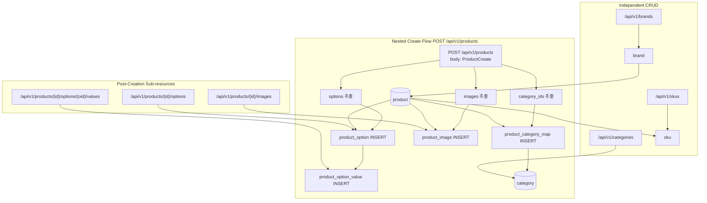

# Product 도메인 리팩토링 계획

## 1. Gap 분석: 현재 상태 vs 필요한 상태

### 현재 Product 라우터 [`backend/app/routers/product.py`](backend/app/routers/product.py) 문제점

| 기능 | 테이블 | 현재 상태 | 필요한 상태 |
|------|--------|----------|------------|
| Category CRUD | `category` | ❌ 없음 | Category 독립 CRUD 필요 |
| Product-Category 매핑 | `product_category_map` | ❌ `create_product`에서 미처리 | 생성/수정 시 `category_ids` 전달 필요 |
| ProductOption CRUD | `product_option` | ❌ 없음 | **Nested create** + 서브 리소스 CRUD 필요 |
| ProductOptionValue CRUD | `product_option_value` | ❌ 없음 | **Nested create** + 서브 리소스 CRUD 필요 |
| ProductImage CRUD | `product_image` | ❌ 없음 | **Nested create** + 서브 리소스 CRUD 필요 |
| SKU CRUD | `sku` | ✅ 생성됨 (`routers/sku.py`) | 유지 |
| Brand CRUD | `brand` | ✅ 생성됨 (`routers/brand.py`) | 유지 |

### ProductRead 응답 구조 (이미 적절함 - 유지)
```python
class ProductRead:
    brand: Optional[BrandRead]
    categories: list[CategoryRead]      # ✅ 이미 포함
    options: list[ProductOptionRead]     # ✅ 이미 포함 (values 포함)
    images: list[ProductImageRead]       # ✅ 이미 포함
    skus: list[SKURead]                  # ✅ 이미 포함
```

---

## 2. 변경 상세 명세

### Phase 1: Schema 추가 [`backend/app/schemas/product.py`](backend/app/schemas/product.py)

기존 `ProductCreate`에 `category_ids`, `options`, `images` 필드를 **중첩(Nested)** 으로 추가하고,
이를 처리하기 위한 Create 스키마들을 신규 정의한다.

#### CategoryCreate
```python
class CategoryCreate(ORMBaseSchema):
    parent_category_id: Optional[int] = None
    category_name: str = Field(..., max_length=255)
    category_depth: int
    created_by: Optional[int] = None
```

#### CategoryUpdate
```python
class CategoryUpdate(ORMBaseSchema):
    parent_category_id: Optional[int] = None
    category_name: Optional[str] = Field(default=None, max_length=255)
    category_depth: Optional[int] = None
    updated_by: Optional[int] = None
```

#### ProductOptionValueCreate (nested create용)
```python
class ProductOptionValueCreate(ORMBaseSchema):
    option_value: str = Field(..., max_length=100)
```

#### ProductOptionCreate (nested create용 - values 포함)
```python
class ProductOptionCreate(ORMBaseSchema):
    option_name: str = Field(..., max_length=100)
    sort_order: Optional[int] = None
    values: list[ProductOptionValueCreate] = Field(default_factory=list)
    created_by: Optional[int] = None
```

#### ProductImageCreate (nested create용)
```python
class ProductImageCreate(ORMBaseSchema):
    image_url: str = Field(..., max_length=500)
    is_main_image: Optional[bool] = None
    sort_order: Optional[int] = None
    created_by: Optional[int] = None
```

#### ProductOptionUpdate / ProductOptionValueUpdate (서브 리소스 PUT 용)
```python
class ProductOptionUpdate(ORMBaseSchema):
    option_name: Optional[str] = Field(default=None, max_length=100)
    sort_order: Optional[int] = None
    updated_by: Optional[int] = None

class ProductOptionValueUpdate(ORMBaseSchema):
    option_value: Optional[str] = Field(default=None, max_length=100)
```

#### ProductImageUpdate (서브 리소스 PUT 용)
```python
class ProductImageUpdate(ORMBaseSchema):
    image_url: Optional[str] = Field(default=None, max_length=500)
    is_main_image: Optional[bool] = None
    sort_order: Optional[int] = None
    updated_by: Optional[int] = None
```

#### ProductCreate 확장 (category_ids + options + images 중첩)
```python
class ProductCreate(ProductBase):
    created_by: Optional[int] = None
    category_ids: list[int] = Field(default_factory=list)           # 추가
    options: list[ProductOptionCreate] = Field(default_factory=list)   # 추가 - 중첩 생성
    images: list[ProductImageCreate] = Field(default_factory=list)     # 추가 - 중첩 생성
```

#### ProductUpdate 확장 (category_ids 필드 추가)
```python
class ProductUpdate(ORMBaseSchema):
    # ... 기존 필드 유지 ...
    category_ids: Optional[list[int]] = None  # 추가 - None이면 변경 안함
```

---

### Phase 2: Category 라우터 생성 [`backend/app/routers/category.py`](backend/app/routers/category.py)

`prefix="/categories"`, `tags=["category"]`

| Method | Endpoint | 설명 |
|--------|----------|------|
| `GET` | `/api/v1/categories` | 전체 카테고리 목록 조회 (계층 구조 포함) |
| `GET` | `/api/v1/categories/{category_id}` | 카테고리 상세 + 하위 카테고리 |
| `POST` | `/api/v1/categories` | 카테고리 생성 (parent_category_id로 계층 지정) |
| `PUT` | `/api/v1/categories/{category_id}` | 카테고리 수정 |
| `DELETE` | `/api/v1/categories/{category_id}` | 카테고리 소프트 삭제 |

---

### Phase 3: Product Router 수정 (Nested Create 핵심) [`backend/app/routers/product.py`](backend/app/routers/product.py)

#### `create_product` 수정 - 중첩 생성 처리

```python
def create_product(payload: ProductCreate, db: Session = Depends(get_db)):
    # 1. Product 기본 정보 생성
    product = Product(
        product_name=payload.product_name,
        product_description=payload.product_description,
        brand_id=payload.brand_id,
        product_status=payload.product_status,
        base_price_amount=payload.base_price_amount,
        thumbnail_image_url=payload.thumbnail_image_url,
        created_by=payload.created_by,
    )
    db.add(product)
    db.flush()  # product.id 확보

    # 2. category_ids → product_category_map INSERT
    for cat_id in payload.category_ids:
        db.add(ProductCategoryMap(product_id=product.id, category_id=cat_id))

    # 3. options → product_option + product_option_value INSERT
    for opt in payload.options:
        option = ProductOption(
            product_id=product.id,
            option_name=opt.option_name,
            sort_order=opt.sort_order,
            created_by=opt.created_by or payload.created_by,
        )
        db.add(option)
        db.flush()
        for val in opt.values:
            db.add(ProductOptionValue(
                option_id=option.id,
                option_value=val.option_value,
            ))

    # 4. images → product_image INSERT
    for img in payload.images:
        db.add(ProductImage(
            product_id=product.id,
            image_url=img.image_url,
            is_main_image=img.is_main_image,
            sort_order=img.sort_order,
            created_by=img.created_by or payload.created_by,
        ))

    db.commit()
    db.refresh(product)
    return APIResponse(data=_product_query().filter(Product.id == product.id).first(), ...)
```

**핵심**: `db.flush()`를 사용하여 생성된 `product.id`를 즉시 확보한 후, 관련 레코드들을 같은 트랜잭션 내에서 INSERT한다.

#### `update_product` 수정 - category_ids 교체

```python
def update_product(product_id: int, payload: ProductUpdate, db: Session = Depends(get_db)):
    product = _get_product_or_404(db, product_id)
    update_data = payload.model_dump(exclude_unset=True)

    # 1. Product 기본 필드 업데이트
    for field, value in update_data.items():
        if field != "category_ids" and hasattr(product, field):
            setattr(product, field, value)

    # 2. category_ids 제공 시 기존 매핑 삭제 후 재INSERT
    if "category_ids" in update_data and payload.category_ids is not None:
        db.query(ProductCategoryMap).filter(
            ProductCategoryMap.product_id == product_id
        ).delete()
        for cat_id in payload.category_ids:
            db.add(ProductCategoryMap(product_id=product_id, category_id=cat_id))

    db.commit()
    db.refresh(product)
    return APIResponse(data=_product_query().filter(Product.id == product_id).first(), ...)
```

---

### Phase 4: 서브 리소스 엔드포인트 추가 (Post-Creation 관리) [`backend/app/routers/product.py`](backend/app/routers/product.py)

Product 생성 후 개별 옵션/값/이미지를 추가/수정/삭제할 수 있는 서브 리소스 엔드포인트.

#### ProductOption/Value 서브 리소스

| Method | Endpoint | 설명 |
|--------|----------|------|
| `GET` | `/api/v1/products/{product_id}/options` | 특정 상품의 옵션 목록 조회 |
| `POST` | `/api/v1/products/{product_id}/options` | 옵션 생성 (values 배열로 값들 함께 생성) |
| `PUT` | `/api/v1/products/{product_id}/options/{option_id}` | 옵션명/정렬순서 수정 |
| `DELETE` | `/api/v1/products/{product_id}/options/{option_id}` | 옵션 + 하위 값들 전체 삭제 |
| `POST` | `/api/v1/products/{product_id}/options/{option_id}/values` | 옵션 값 추가 |
| `PUT` | `/api/v1/products/{product_id}/options/{option_id}/values/{value_id}` | 옵션 값 수정 |
| `DELETE` | `/api/v1/products/{product_id}/options/{option_id}/values/{value_id}` | 옵션 값 삭제 |

#### ProductImage 서브 리소스

| Method | Endpoint | 설명 |
|--------|----------|------|
| `GET` | `/api/v1/products/{product_id}/images` | 특정 상품의 이미지 목록 조회 |
| `POST` | `/api/v1/products/{product_id}/images` | 이미지 추가 |
| `PUT` | `/api/v1/products/{product_id}/images/{image_id}` | 이미지 수정 (대표이미지/정렬순서) |
| `DELETE` | `/api/v1/products/{product_id}/images/{image_id}` | 이미지 삭제 |

---

## 3. 데이터 흐름 다이어그램



---

## 4. 실행 순서 (Todo)

1. **Schema 추가**: [`backend/app/schemas/product.py`](backend/app/schemas/product.py)
   - `CategoryCreate`, `CategoryUpdate` 추가
   - `ProductOptionValueCreate`, `ProductOptionCreate` 추가 (values 포함)
   - `ProductImageCreate`, `ProductImageUpdate` 추가
   - `ProductOptionUpdate`, `ProductOptionValueUpdate` 추가
   - `ProductCreate`에 `category_ids`, `options`, `images` 필드 확장
   - `ProductUpdate`에 `category_ids` 필드 추가
   - `__all__` 업데이트

2. **Category Router 생성**: [`backend/app/routers/category.py`](backend/app/routers/category.py)
   - Category CRUD (GET/POST/PUT/DELETE)
   - `_category_query()` with `selectinload(Category.children)`
   - `_get_category_or_404(db, category_id)`

3. **Product Router 확장 - Nested Create**: [`backend/app/routers/product.py`](backend/app/routers/product.py)
   - `create_product`: `category_ids` → `ProductCategoryMap` INSERT
   - `create_product`: `options` → `ProductOption` + `ProductOptionValue` INSERT
   - `create_product`: `images` → `ProductImage` INSERT
   - `update_product`: `category_ids` 교체 로직
   - 서브 리소스 엔드포인트 추가 (Phase 4의 Option/Value/Image 엔드포인트)

4. **Router 등록**: [`backend/app/routers/__init__.py`](backend/app/routers/__init__.py)
   - `category_router` import 및 `api_router.include_router` 등록

5. **Docker 빌드 및 테스트**: 이미지 재빌드, 컨테이너 재시작 후 Swagger 검증
   - `docker compose build --no-cache && docker compose up -d`
   - Swagger `/docs`에서 ProductCreate body에 `options`, `images`, `category_ids` 필드 확인
   - 실제 POST /api/v1/products 요청 테스트 (옵션/이미지/카테고리 포함)
