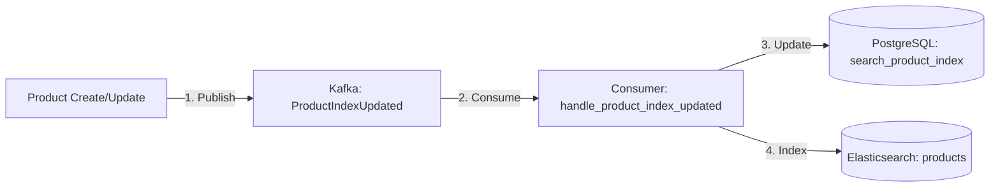
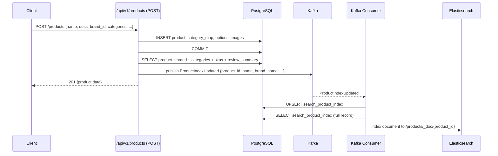
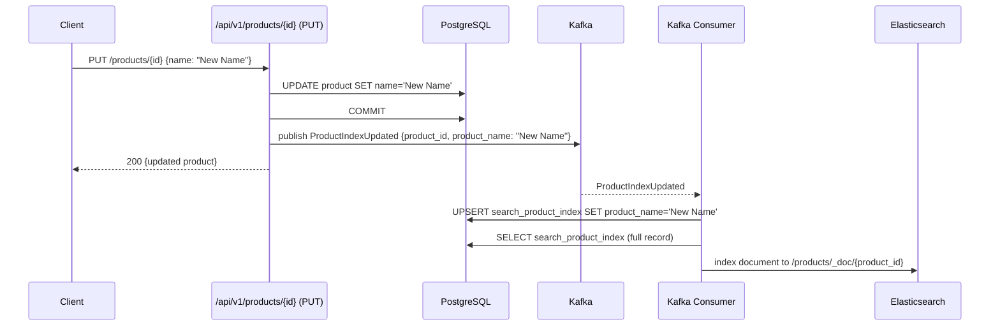
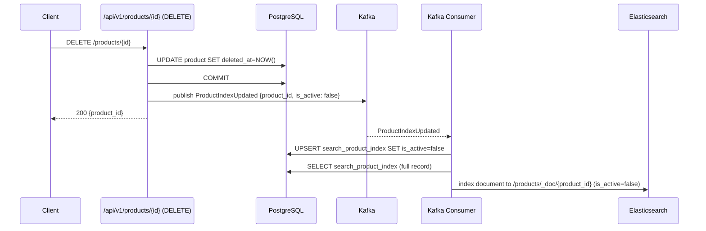

# Search 도메인 Elasticsearch 인덱싱 구현 계획

## 1. 현재 상태 분석

### 1.1 아키텍처 개요

설계 문서 §2.10에 따르면 Search 도메인의 아키텍처는 **DB → Kafka → Elasticsearch** 파이프라인이다.



### 1.2 현재 구현된 컴포넌트

| 컴포넌트 | 상태 | 파일 |
|---------|------|------|
| `ProductIndexUpdatedEvent` 스키마 | ✅ 구현됨 | [`backend/app/events/schemas.py:84`](../backend/app/events/schemas.py:84) |
| Kafka Producer (`publish_event`) | ✅ 구현됨 | [`backend/app/events/producer.py:53`](../backend/app/events/producer.py:53) |
| Kafka Consumer 메인 루프 | ✅ 구현됨 | [`backend/app/events/consumer.py:748`](../backend/app/events/consumer.py:748) |
| 핸들러 매핑 등록 | ✅ 구현됨 | [`backend/app/events/consumer.py:744`](../backend/app/events/consumer.py:744) |
| `SearchProductIndex` ORM 모델 | ✅ 구현됨 | [`backend/app/models/search.py:15`](../backend/app/models/search.py:15) |
| `SearchProductIndex` CRUD | ✅ 구현됨 | [`backend/app/crud/search_crud.py:22`](../backend/app/crud/search_crud.py:22) |
| Search Router (REST API) | ✅ 구현됨 | [`backend/app/routers/search.py`](../backend/app/routers/search.py) |
| `ELASTICSEARCH_URL` 설정 | ✅ 구현됨 | [`backend/app/core/config.py:39`](../backend/app/core/config.py:39) |
| Elasticsearch Docker 컨테이너 | ✅ 구현됨 | [`backend/docker-compose.yml:52`](../backend/docker-compose.yml:52) |

### 1.3 구현되지 않은 컴포넌트 (Gap)

| 컴포넌트 | 상태 | 위치 |
|---------|------|------|
| **Gap 1**: Product 생성/수정/삭제 시 이벤트 발행 | ❌ 미구현 | [`backend/app/routers/product.py:165-269`](../backend/app/routers/product.py:165) |
| **Gap 2**: Consumer 핸들러 내 DB 업데이트 | ❌ TODO (주석 처리) | [`backend/app/events/consumer.py:707-731`](../backend/app/events/consumer.py:707) |
| **Gap 3**: Consumer 핸들러 내 ES 인덱싱 | ❌ TODO (주석 처리) | [`backend/app/events/consumer.py:733-735`](../backend/app/events/consumer.py:733) |
| **Gap 4**: Elasticsearch 서비스 파일 | ❌ 없음 (services/ 디렉토리 미존재) | `backend/app/services/elasticsearch.py` |
| **Gap 5**: `elasticsearch-py` 패키지 | ❌ requirements.txt에 없음 | [`backend/requirements.txt`](../backend/requirements.txt) |

### 1.4 데이터 모델 관계 (Denormalization 출처)

`SearchProductIndex` 테이블의 각 필드는 다음 Product 관계에서 파생된다:

| SearchProductIndex 필드 | 출처 (Product 관계) | SQLAlchemy 경로 |
|------------------------|-------------------|----------------|
| `product_name` | `Product.product_name` | 직접 필드 |
| `product_description` | `Product.product_description` | 직접 필드 |
| `category_ids` | `Product.categories[].id` | `product.categories` (M:N via ProductCategoryMap) |
| `brand_name` | `Product.brand.brand_name` | `product.brand` (관계) → `Brand.brand_name` |
| `price_amount` | `Product.skus[].sale_price_amount` (최소값) | `product.skus` → `SKU.sale_price_amount` |
| `average_rating` | `Product.review_summary.average_rating` | `product.review_summary` (uselist=False) |
| `review_count` | `Product.review_summary.review_count` | `product.review_summary` (uselist=False) |
| `stock_quantity` | `Product.skus[].stock_quantity` (합계) | `product.skus` → `SKU.stock_quantity` |
| `is_active` | `Product.product_status == 'ACTIVE'` | 직접 필드 |

### 1.5 이벤트 스키마 분석

현재 [`ProductIndexUpdatedEvent`](../backend/app/events/schemas.py:84)는 다음 필드를 포함한다:

```python
class ProductIndexUpdatedEvent(BaseModel):
    product_id: int
    product_name: Optional[str] = None
    product_description: Optional[str] = None
    category_ids: Optional[list[int]] = None
    brand_name: Optional[str] = None
    price_amount: Optional[Decimal] = None
    is_active: Optional[bool] = None
```

**⚠️ 주의**: `average_rating`, `review_count`, `stock_quantity` 필드가 이벤트에 포함되지 않았다.

이유 분석:
- `average_rating`, `review_count` → Review 생성/수정 시 업데이트되어야 함 (Product 수정 시점과 무관)
- `stock_quantity` → Inventory 변경 시 업데이트되어야 함 (Product 수정 시점과 무관)

**결론**: 현재 스키마는 Product 생성/수정 시점에 적절하다. Rating/Stock은 별도 흐름에서 업데이트되어야 하지만, 이것은 **현재 범위 밖**이다. ES 인덱싱 시 DB의 `SearchProductIndex` 전체 값을 읽어서 ES에 저장하면, rating/stock은 그 시점의 최신값을 반영한다.

---

## 2. 구현 계획

### Step 1: `elasticsearch-py` 패키지 추가

**파일**: [`backend/requirements.txt`](../backend/requirements.txt)

`elasticsearch==8.13.4` 추가 (ES Docker 이미지 버전과 일치).

### Step 2: Elasticsearch 서비스 생성

**신규 파일**: `backend/app/services/__init__.py` (빈 파일)
**신규 파일**: `backend/app/services/elasticsearch.py`

```python
# elasticsearch.py 핵심 기능
- get_es_client() → Elasticsearch 싱글톤 클라이언트
- index_product(product_id: int) → SearchProductIndex 조회 → ES upsert
- delete_product(product_id: int) → ES delete
```

ES 인덱스 이름: `products` (단수형, 한 타입만 저장)

Mapping 설계:
```json
{
  "mappings": {
    "properties": {
      "product_id": { "type": "long" },
      "product_name": { 
        "type": "text",
        "fields": { "keyword": { "type": "keyword" } }
      },
      "product_description": { "type": "text" },
      "category_ids": { "type": "long" },
      "brand_name": { "type": "keyword" },
      "price_amount": { "type": "double" },
      "average_rating": { "type": "double" },
      "review_count": { "type": "integer" },
      "stock_quantity": { "type": "integer" },
      "is_active": { "type": "boolean" },
      "search_keywords": { "type": "text" },
      "updated_at": { "type": "date" }
    }
  }
}
```

### Step 3: Consumer 핸들러 구현

**파일**: [`backend/app/events/consumer.py:687-735`](../backend/app/events/consumer.py:687)

기존 TODO 코드의 주석을 해제하고 다음 로직을 활성화한다:

1. DB 세션 생성 (`SessionLocal()`)
2. `SearchProductIndex` upsert (이벤트 필드로 부분 업데이트)
3. Transaction commit
4. Elasticsearch 인덱싱 호출 (`index_product(product_id)`)
5. finally에서 DB 세션 종료

**핵심 로직**:
- 이벤트의 필드가 `None`이 아닌 경우에만 해당 DB 컬럼 업데이트 (partial update)
- ES 인덱싱은 전체 `SearchProductIndex` 레코드를 읽어서 저장

### Step 4: Product Router에 이벤트 발행 추가

**파일**: [`backend/app/routers/product.py`](../backend/app/routers/product.py)

세 곳에 이벤트 발행 추가:

1. **`create_product()`** (line 165-221) — `db.commit()` 후
   - 이벤트 필드: product_id, product_name, product_description, category_ids, brand_name, price_amount, is_active
   - brand_name → `product.brand.brand_name` 조회 필요
   
2. **`update_product()`** (line 224-254) — `db.commit()` 후
   - 변경된 필드만 이벤트에 포함 (payload에서 `exclude_unset=True` 사용)
   
3. **`delete_product()`** (line 262-269) — soft delete 후
   - `is_active=False` 이벤트 발행

**구현 방식**: `publish_event()`는 async 함수이므로, sync router 함수에서 `asyncio.create_task()`로 fire-and-forget 실행.

**참고**: [`backend/app/routers/order.py:212-234`](../backend/app/routers/order.py:212)의 `_publish_order_created` 패턴 참조.

---

## 3. 데이터 흐름 상세

### 3.1 Product 생성 시



### 3.2 Product 수정 시



### 3.3 Product 삭제 시



---

## 4. 상세 구현 지침

### 4.1 `backend/app/services/elasticsearch.py`

```python
from elasticsearch import Elasticsearch
from app.core.config import settings
from app.database import SessionLocal
from app.models.search import SearchProductIndex

_es_client: Optional[Elasticsearch] = None

def get_es_client() -> Elasticsearch:
    global _es_client
    if _es_client is None:
        _es_client = Elasticsearch(settings.ELASTICSEARCH_URL)
    return _es_client

async def index_product(product_id: int) -> bool:
    """SearchProductIndex DB 레코드를 ES에 인덱싱한다."""
    es = get_es_client()
    db = SessionLocal()
    try:
        index = db.query(SearchProductIndex).filter(
            SearchProductIndex.product_id == product_id
        ).first()
        if index is None:
            logger.warning("SearchProductIndex not found: product_id=%s", product_id)
            return False
        
        doc = {
            "product_id": index.product_id,
            "product_name": index.product_name,
            "product_description": index.product_description,
            "category_ids": index.category_ids,
            "brand_name": index.brand_name,
            "price_amount": float(index.price_amount) if index.price_amount else None,
            "average_rating": float(index.average_rating) if index.average_rating else None,
            "review_count": index.review_count,
            "stock_quantity": index.stock_quantity,
            "is_active": index.is_active,
            "search_keywords": index.search_keywords,
            "updated_at": index.updated_at.isoformat() if index.updated_at else None,
        }
        
        es.index(index="products", id=product_id, body=doc)
        logger.info("ES indexed: product_id=%s", product_id)
        return True
    finally:
        db.close()

async def delete_product(product_id: int) -> bool:
    """ES에서 상품 문서를 삭제한다."""
    es = get_es_client()
    try:
        es.delete(index="products", id=product_id, ignore=[404])
        logger.info("ES deleted: product_id=%s", product_id)
        return True
    except Exception as exc:
        logger.error("ES delete failed: product_id=%s error=%s", product_id, exc)
        return False
```

### 4.2 `handle_product_index_updated()` 수정 (consumer.py:687-735)

기존 TODO 주석을 제거하고 실제 로직으로 대체:

```python
async def handle_product_index_updated(message_value: dict[str, Any]) -> None:
    """ProductIndexUpdated 이벤트 처리 → Elasticsearch 인덱싱."""
    event = ProductIndexUpdatedEvent(**message_value)
    logger.info("Handling ProductIndexUpdated: product_id=%s", event.product_id)

    event_id = f"{TOPIC_PRODUCT_INDEX_UPDATED}:{event.product_id}:{event.occurred_at}"
    if is_duplicate(event_id):
        return

    # Phase 1: SearchProductIndex DB 업데이트
    db = SessionLocal()
    try:
        index = db.query(SearchProductIndex).filter(
            SearchProductIndex.product_id == event.product_id
        ).first()
        if index is None:
            index = SearchProductIndex(product_id=event.product_id)
            db.add(index)
        if event.product_name is not None:
            index.product_name = event.product_name
        if event.product_description is not None:
            index.product_description = event.product_description
        if event.category_ids is not None:
            index.category_ids = event.category_ids
        if event.brand_name is not None:
            index.brand_name = event.brand_name
        if event.price_amount is not None:
            index.price_amount = event.price_amount
        if event.is_active is not None:
            index.is_active = event.is_active
        db.commit()
    finally:
        db.close()

    # Phase 2: Elasticsearch 인덱싱
    from app.services.elasticsearch import index_product
    await index_product(event.product_id)
```

### 4.3 Product Router에 이벤트 발행 추가

`create_product()` (line 217-221 사이, `db.commit()` 후):

```python
import asyncio
from app.events.producer import publish_event, TOPIC_PRODUCT_INDEX_UPDATED
from app.events.schemas import ProductIndexUpdatedEvent

# db.commit() 후, return 전에 추가:
try:
    brand_name = product.brand.brand_name if product.brand else None
    category_ids = [cat.id for cat in product.categories]
    price_amount = min(
        (sku.sale_price_amount for sku in product.skus if sku.sku_status == 'ACTIVE'),
        default=None,
    )
    event = ProductIndexUpdatedEvent(
        product_id=product.id,
        product_name=product.product_name,
        product_description=product.product_description,
        category_ids=category_ids,
        brand_name=brand_name,
        price_amount=price_amount,
        is_active=(product.product_status == 'ACTIVE'),
    )
    asyncio.create_task(publish_event(
        topic=TOPIC_PRODUCT_INDEX_UPDATED,
        key=str(product.id),
        event=event,
    ))
except Exception as exc:
    logger.warning("Failed to publish ProductIndexUpdated: %s", exc)
```

`update_product()`에도 유사한 방식 적용.

---

## 5. ES 인덱스 초기화

Elasticsearch 인덱스가 최초로 생성될 때 mapping이 자동 생성된다. 그러나 명시적인 mapping이 권장되므로, 애플리케이션 시작 시 인덱스를 확인하고 없으면 생성하는 로직을 `main.py`의 `lifespan`에 추가할 수 있다.

또는 기존 데이터를 일괄 인덱싱하는 스크립트 (`scripts/bulk_index_to_es.py`)도 고려.

---

## 6. 파일 변경 요약

| 파일 | 변경 유형 | 설명 |
|------|----------|------|
| `backend/requirements.txt` | 수정 | `elasticsearch==8.13.4` 추가 |
| `backend/app/services/__init__.py` | 신규 | 빈 패키지 파일 |
| `backend/app/services/elasticsearch.py` | 신규 | ES 클라이언트 및 인덱싱 함수 |
| `backend/app/events/consumer.py` | 수정 | handle_product_index_updated() 실제 구현 |
| `backend/app/routers/product.py` | 수정 | create/update/delete 시 이벤트 발행 |

---

## 7. 테스트 검증 방법

1. **Docker 환경 확인**: `docker-compose ps`로 elasticsearch 컨테이너 실행 확인
2. **Product 생성 API 호출**: POST /api/v1/products → 201 응답
3. **Kafka 메시지 확인**: Consumer 로그에서 "Handling ProductIndexUpdated" 출력 확인
4. **ES 문서 확인**: `curl http://localhost:9200/products/_doc/{product_id}` 로 인덱싱 확인
5. **DB 확인**: `SELECT * FROM search_product_index WHERE product_id = {product_id}` 로 레코드 확인
