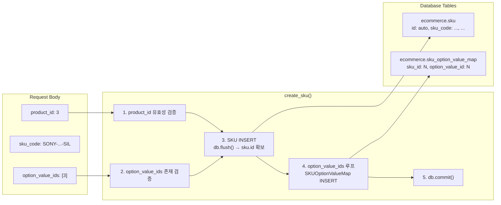

# SKU 생성 시 sku_option_value_map 복합 생성 리팩토링 Plan

## 1. 문제 상황

현재 [`POST /api/v1/skus`](backend/app/routers/sku.py:70)는 `ecommerce.sku` 테이블에만 레코드를 생성하고,
`ecommerce.sku_option_value_map`(SKU와 ProductOptionValue의 M:N 연결)은 전혀 처리하지 않는다.

```python
# 현재 sku.py 라우터 - SKU만 생성, 매핑 미처리
sku = SKU(product_id=..., sku_code=..., ...)
db.add(sku)
db.commit()
```

`SKUOptionValueMapCRUD` 클래스는 [`backend/app/crud/product_crud.py:596`](backend/app/crud/product_crud.py:596)에 존재하지만,
이를 호출하는 API 엔드포인트가 **전혀 없다**.

## 2. 대상 파일

| 파일 | 역할 | 변경 사항 |
|------|------|-----------|
| [`backend/app/schemas/product.py`](backend/app/schemas/product.py:148) | SKUCreate 스키마 | `option_value_ids: list[int]` 필드 추가 |
| [`backend/app/routers/sku.py`](backend/app/routers/sku.py:70) | SKU 생성 라우터 | option_value_ids 검증 및 매핑 INSERT 로직 추가 |
| [`backend/tests/unit/test_product_domain.py`](backend/tests/unit/test_product_domain.py) | 단위 테스트 | SKU 생성 + 매핑 테스트 추가 |

---

## 3. 변경 상세

### Step 1: Schema 수정 — [`backend/app/schemas/product.py`](backend/app/schemas/product.py)

**변경 전:**
```python
class SKUCreate(ORMBaseSchema):
    """SKU 생성 요청 스키마."""
    product_id: int
    sku_code: str = Field(..., max_length=100)
    sale_price_amount: Decimal = Field(..., max_digits=12, decimal_places=2)
    stock_quantity: int = Field(default=0)
    sku_status: str = Field(..., max_length=20)
    created_by: Optional[int] = None
```

**변경 후:**
```python
class SKUCreate(ORMBaseSchema):
    """SKU 생성 요청 스키마 (option_value_ids로 옵션 값 연결 지원)."""
    product_id: int
    sku_code: str = Field(..., max_length=100)
    sale_price_amount: Decimal = Field(..., max_digits=12, decimal_places=2)
    stock_quantity: int = Field(default=0)
    sku_status: str = Field(..., max_length=20)
    created_by: Optional[int] = None
    option_value_ids: list[int] = Field(default_factory=list)  # ★ 추가
```

**변경 포인트:**
- `option_value_ids: list[int]` 필드 추가 (기본값 빈 리스트 → 기존 호환성 유지)
- docstring 업데이트

---

### Step 2: Router 수정 — [`backend/app/routers/sku.py`](backend/app/routers/sku.py)

**변경 전:**
```python
@router.post("", response_model=APIResponse[SKURead], summary="SKU 생성")
def create_sku(payload: SKUCreate, db: Session = Depends(get_db)) -> APIResponse[SKURead]:
    _validate_product_exists(db, payload.product_id)

    sku = SKU(product_id=payload.product_id, sku_code=payload.sku_code, ...)
    db.add(sku)
    db.commit()
    db.refresh(sku)
    return APIResponse(data=sku, message="SKU를 생성했습니다.")
```

**변경 후:**
```python
from app.models.product import Product, SKU, ProductOptionValue, SKUOptionValueMap  # SKUOptionValueMap import 추가

def _validate_option_values_exist(db: Session, product_id: int, option_value_ids: list[int]) -> None:
    """option_value_id들이 해당 Product에 속하는 유효한 값인지 검증한다."""
    if not option_value_ids:
        return
    existing = set()
    for ov_id in option_value_ids:
        stmt = select(ProductOptionValue).where(
            ProductOptionValue.id == ov_id,
            ProductOptionValue.deleted_at.is_(None),
        )
        ov = db.execute(stmt).scalar_one_or_none()
        if ov is None:
            raise HTTPException(
                status_code=404,
                detail=f"OptionValue(ID={ov_id})를 찾을 수 없습니다.",
            )
        existing.add(ov.option_id)
    # 중복 option_id 검증 (같은 옵션에서 두 개 값 선택 방지)
    if len(existing) != len(option_value_ids):
        # 이건 실제로는 sku_option_value_map이 복합키라 같은 option_id에서 여러 값이 들어갈 수 있음
        # 옵션 개념상 같은 옵션 그룹에서 여러 값을 선택할 수 없으므로 경고
        pass


@router.post("", response_model=APIResponse[SKURead], summary="SKU 생성")
def create_sku(payload: SKUCreate, db: Session = Depends(get_db)) -> APIResponse[SKURead]:
    """새로운 SKU를 생성하고, 옵션 값 매핑도 함께 처리한다."""
    _validate_product_exists(db, payload.product_id)
    _validate_option_values_exist(db, payload.product_id, payload.option_value_ids)

    sku = SKU(
        product_id=payload.product_id,
        sku_code=payload.sku_code,
        sale_price_amount=payload.sale_price_amount,
        stock_quantity=payload.stock_quantity,
        sku_status=payload.sku_status,
        created_by=payload.created_by,
    )
    db.add(sku)
    db.flush()  # sku.id 확보를 위해 flush

    # option_value_ids → sku_option_value_map INSERT
    for ov_id in payload.option_value_ids:
        mapping = SKUOptionValueMap(sku_id=sku.id, option_value_id=ov_id)
        db.add(mapping)

    db.commit()
    db.refresh(sku)
    return APIResponse(data=sku, message="SKU를 생성했습니다.")
```

**변경 포인트:**
1. `from app.models.product import ... SKUOptionValueMap` import 추가
2. `_validate_option_values_exist()` 헬퍼 함수 추가
3. `create_sku()`에서 `db.flush()`로 `sku.id` 확보 후, `option_value_ids`를 순회하며 `SKUOptionValueMap` INSERT
4. `db.commit()`은 모든 INSERT 완료 후 한 번에 실행

---

### Step 3: 단위 테스트 추가 — [`backend/tests/unit/test_product_domain.py`](backend/tests/unit/test_product_domain.py)

기존 파일에 아래 테스트들을 추가:

```python
from app.schemas.product import SKUCreate  # 기존 import에 SKUCreate 추가
from app.models.product import SKUOptionValueMap  # 신규 import


def test_sku_create_schema_supports_option_value_ids() -> None:
    """SKUCreate 스키마가 option_value_ids 필드를 지원해야 한다."""
    payload = SKUCreate(
        product_id=1,
        sku_code="TEST-SKU-001",
        sale_price_amount=Decimal("10000.00"),
        stock_quantity=10,
        sku_status="ACTIVE",
        option_value_ids=[1, 3],  # 옵션 값 ID 목록
    )
    assert payload.option_value_ids == [1, 3]
    assert payload.model_dump()["option_value_ids"] == [1, 3]


def test_sku_create_schema_default_option_value_ids_is_empty() -> None:
    """option_value_ids 미제공 시 기본값은 빈 리스트여야 한다."""
    payload = SKUCreate(
        product_id=1,
        sku_code="TEST-SKU-002",
        sale_price_amount=Decimal("20000.00"),
        stock_quantity=5,
        sku_status="ACTIVE",
    )
    assert payload.option_value_ids == []


def test_sku_option_value_map_table_is_defined() -> None:
    """SKUOptionValueMap 모델의 기본 키가 복합키로 정의되어야 한다."""
    assert SKUOptionValueMap.__tablename__ == "sku_option_value_map"
    # 복합 기본키: (sku_id, option_value_id)
    pk_columns = list(SKUOptionValueMap.__table__.primary_key.columns)
    pk_names = {col.name for col in pk_columns}
    assert "sku_id" in pk_names
    assert "option_value_id" in pk_names


def test_sku_router_registers_expected_routes() -> None:
    """SKU 라우터에 CRUD 엔드포인트가 등록되어야 한다."""
    from app.routers.sku import router as sku_router
    route_map = {(tuple(sorted(route.methods)), route.path) for route in sku_router.routes}

    assert (("GET",), "/skus") in route_map
    assert (("GET",), "/skus/{sku_id}") in route_map
    assert (("POST",), "/skus") in route_map
    assert (("PUT",), "/skus/{sku_id}") in route_map
    assert (("DELETE",), "/skus/{sku_id}") in route_map
```

---

## 4. Swagger 테스트 JSON (변경 후)

`option_value_ids` 필드가 추가된 SKU 생성 JSON:

### 에이수스 ROG G14 — 32GB

```json
{
  "product_id": 2,
  "sku_code": "ASUS-ROG-G14-32GB",
  "sale_price_amount": 1890000.00,
  "stock_quantity": 50,
  "sku_status": "ACTIVE",
  "created_by": 1,
  "option_value_ids": [2]
}
```

### 소니 WH-1000XM5 — 플래티넘 실버

```json
{
  "product_id": 3,
  "sku_code": "SONY-WH1000XM5-SIL",
  "sale_price_amount": 450000.00,
  "stock_quantity": 100,
  "sku_status": "ACTIVE",
  "created_by": 1,
  "option_value_ids": [3]
}
```

### 옵션 없는 상품 (델 U2723QE) — option_value_ids 생략 가능

```json
{
  "product_id": 5,
  "sku_code": "DELL-U2723QE-BASE",
  "sale_price_amount": 820000.00,
  "stock_quantity": 25,
  "sku_status": "ACTIVE",
  "created_by": 1
}
```

---

## 5. Mermaid: 변경 후 데이터 흐름



---

## 6. 영향도 분석

| 항목 | 영향 | 비고 |
|------|------|------|
| 기존 API 호환성 | ✅ **하위 호환** | `option_value_ids` 기본값이 `[]`이므로 기존 요청 영향 없음 |
| SKU 목록 조회 | ✅ **변경 없음** | `GET /api/v1/skus`는 `selectinload` 없이도 동작 |
| SKU 상세 조회 | ✅ **변경 없음** | `GET /api/v1/skus/{id}`는 SKU 단일 조회 |
| Cart SKU 검증 | ✅ **변경 없음** | `_validate_sku_for_cart()`는 `sku_option_value_map`과 무관 |
| Inventory | ✅ **변경 없음** | Inventory는 `sku_id`만 참조 |
| 기존 단위 테스트 | ✅ **변경 없음** | 기존 테스트는 `option_value_ids` 없이도 정상 동작 |

---

## 7. 실행 순서

1. **Schema 수정**: `SKUCreate`에 `option_value_ids` 필드 추가
2. **Router 수정**: `create_sku()`에 검증 및 매핑 INSERT 로직 추가
3. **단위 테스트 추가**: 4개 새 테스트
4. **전체 테스트 실행**: `pytest`로 기존 테스트와의 호환성 확인
5. **Swagger 확인**: `/docs`에서 SKU Create body에 `option_value_ids` 필드 표시 확인
