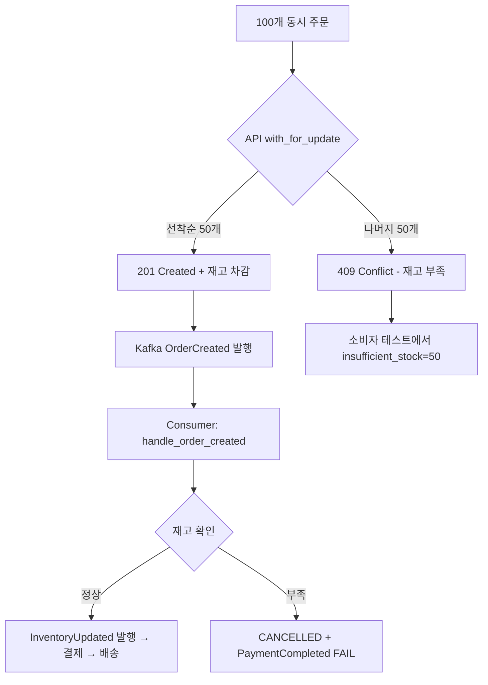

# 재고 소진 후 자동 취소 검증 계획

## 현황 분석

### 현재 코드의 2중 방어 구조

1. **API Layer (Synchronous)** - [`order.py:148-166`](../backend/app/routers/order.py:148)
   - `SELECT ... FOR UPDATE`로 동시성 제어
   - `available_quantity < item_data.quantity` 체크 → 부족 시 **HTTP 409** 반환
   - 재고 차감 및 예약(InventoryReservation)까지 동기 처리

2. **Consumer Layer (Asynchronous)** - [`consumer.py:206-298`](../backend/app/events/consumer.py:206)
   - `handle_order_created`에서 재고 재확인
   - 부족 시: Order → CANCELLED + 재고 롤백 + `PaymentCompleted(FAIL)` 발행
   - `handle_inventory_updated`([line 341](../backend/app/events/consumer.py:341))에서도 이중 체크

### 이전 테스트 결과 분석

- `available_quantity=10000`, 주문 100개 → 재고가 남아돌아 자동 취소 미발동
- API가 항상 201 반환, `insufficient_stock=0`

### 예상되는 정상 동작 (재고 50개, 주문 100개)



## 테스트 계획

### Step 1: Kafka Consumer 상태 확인

- **목적**: Consumer가 Kafka에 연결되어 이벤트를 처리할 수 있는지 확인
- **방법**: Docker 로그에서 `[Kafka]` prefix 로그 검색
- **기대**: `[Kafka] Received event: topic=OrderCreated ...` 등의 로그 출력
- **문제 시**: `.env`에 `KAFKA_BOOTSTRAP_SERVERS=kafka:9092` 명시적 추가 후 컨테이너 재시작

### Step 2: 새로운 검증 스크립트 작성

**파일**: `backend/scripts/stock_exhaustion_test.py`

**주요 변경사항**:

1. **Configurable 초기 재고** (`INITIAL_STOCK = 50`)
2. **2-Phase 실행**:
   - Phase 1: `INITIAL_STOCK`개 주문 → 전부 201 예상
   - Phase 2: `INITIAL_STOCK * 2`개 추가 주문 → 일부 409 예상
3. **DB 상태 검증**:
   - 재고 부족으로 CANCELLED된 주문이 있는지 API로 확인
   - 취소된 주문의 `order_status`가 `CANCELLED`인지 검증
   - `PaymentCompleted(FAIL)`이 발행되어 배송이 생성되지 않았는지 확인
4. **Kafka 로그 검증**:
   - `[Kafka]` prefix 로그 출력 확인 안내
   - 자동 취소 시 `[Kafka] Cancelled: order_id=... reason=SKU(ID=...) 재고 부족` 로그 확인

### Step 3: 실행 및 검증

```bash
cd backend && python scripts/stock_exhaustion_test.py
```

**검증 항목**:

| 항목 | 기대값 | 검증 방법 |
|------|--------|-----------|
| Phase 1 성공 수 | `INITIAL_STOCK` (50) | 201 응답 카운트 |
| Phase 2 성공 수 | 0 (재고 소진됨) | 201 응답 카운트 |
| Phase 2 409 수 | Phase 2 주문 수 (100) | 409 응답 카운트 |
| 총 insufficient_stock | Phase 2 주문 수 (100) | `TestSummary.insufficient_stock` |
| CANCELLED 주문 | Phase 2 주문들 | API `/orders/{id}` 조회 |
| Kafka 로그 | `[Kafka]` prefix 출력 | `docker compose logs app \| grep '\[Kafka\]'` |

### Step 4: 문제 발생 시 대처

| 문제 | 원인 | 해결 |
|------|------|------|
| Kafka Consumer 로그 없음 | Consumer 미연결 | `.env`에 `KAFKA_BOOTSTRAP_SERVERS=kafka:9092` 추가 후 재시작 |
| 409 발생 안 함 | `with_for_update()`가 Race Condition 막지 못함 | 동시성 수준 확인, `CONCURRENT_ORDERS` 조정 |
| CANCELLED 주문 없음 | Consumer가 취소 로직 실행 안 함 | `handle_order_created` 로그 확인, 예외 처리 디버깅 |
| 모든 주문 201 + CANCELLED 없음 | 재고가 충분함 | `INITIAL_STOCK` 값을 줄임 |

## 파일 구조

```
backend/
├── scripts/
│   ├── order_rush_test.py          # 기존 테스트 (수정 없음)
│   └── stock_exhaustion_test.py    # 신규: 재고 소진 검증 전용
└── app/
    └── events/
        └── consumer.py             # 자동 취소 로직 (수정 없음, 검증 대상)
```
