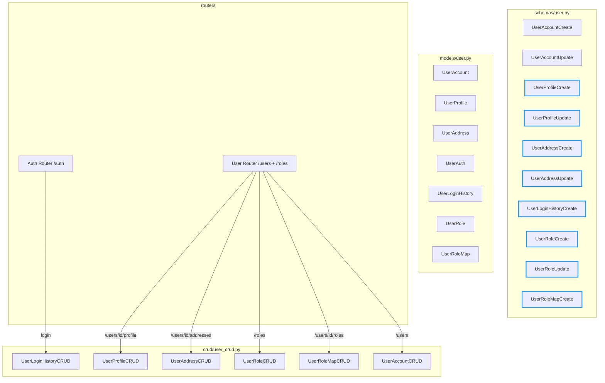
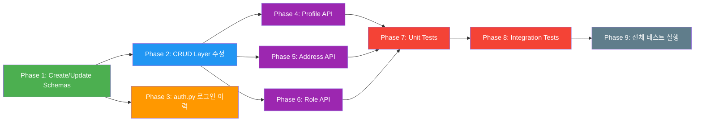

# User 도메인 CRUD 보강 및 로그인 이력 구현 계획

## 문제 정의

USER가 지적한 4가지 갭:
1. **로그인 이력 미기록** — `auth.py`의 `/auth/login`, `/auth/token`에서 `UserLoginHistory`를 생성하지 않음
2. **UserProfile CRUD API 부재** — 프로필 생성/조회/수정/삭제 엔드포인트 없음
3. **UserAddress CRUD API 부재** — 배송지 생성/조회/수정/삭제 엔드포인트 없음
4. **UserRole / UserRoleMap 관리 API 부재** — 역할 CRUD 및 사용자-역할 할당 엔드포인트 없음

---

## Phase 1: Create/Update 스키마 추가 (`schemas/user.py`)

### 대상 파일: [`backend/app/schemas/user.py`](backend/app/schemas/user.py)

**1.1 `UserProfileCreate` / `UserProfileUpdate` 추가**
```python
class UserProfileCreate(ORMBaseSchema):
    user_id: int
    user_name: Optional[str] = None
    phone_number: Optional[str] = None
    birth_date: Optional[date] = None
    gender_code: Optional[str] = None
    created_by: Optional[int] = None

class UserProfileUpdate(ORMBaseSchema):
    user_name: Optional[str] = None
    phone_number: Optional[str] = None
    birth_date: Optional[date] = None
    gender_code: Optional[str] = None
    updated_by: Optional[int] = None
```

**1.2 `UserAddressCreate` / `UserAddressUpdate` 추가**
```python
class UserAddressCreate(ORMBaseSchema):
    user_id: int
    address_name: Optional[str] = None
    recipient_name: Optional[str] = None
    recipient_phone: Optional[str] = None
    postal_code: Optional[str] = None
    address_line1: Optional[str] = None
    address_line2: Optional[str] = None
    is_default_address: Optional[bool] = False

class UserAddressUpdate(ORMBaseSchema):
    address_name: Optional[str] = None
    recipient_name: Optional[str] = None
    recipient_phone: Optional[str] = None
    postal_code: Optional[str] = None
    address_line1: Optional[str] = None
    address_line2: Optional[str] = None
    is_default_address: Optional[bool] = None
    updated_by: Optional[int] = None
```

**1.3 `UserLoginHistoryCreate` 추가**
```python
class UserLoginHistoryCreate(ORMBaseSchema):
    user_id: int
    login_at: Optional[datetime] = None  # default: now()
    ip_address: Optional[str] = None
    user_agent: Optional[str] = None
    login_result: Optional[str] = None  # "SUCCESS" or "FAILURE"
```

**1.4 `UserRoleCreate` / `UserRoleUpdate` 추가**
```python
class UserRoleCreate(ORMBaseSchema):
    role_name: str

class UserRoleUpdate(ORMBaseSchema):
    role_name: Optional[str] = None
```

**1.5 `UserRoleMapCreate` 추가** (할당/해제 전용)
```python
class UserRoleMapCreate(ORMBaseSchema):
    user_id: int
    role_id: int
```

---

## Phase 2: CRUD 레이어 수정 (`user_crud.py`)

### 대상 파일: [`backend/app/crud/user_crud.py`](backend/app/crud/user_crud.py)

현재 `UserProfileCRUD.create()`, `UserAddressCRUD.create()` 등이 Read 스키마를 입력으로 받고 있음.

**2.1 `UserProfileCRUD`**
- `create()`: 인자 타입을 `UserProfileRead` → `UserProfileCreate`로 변경
- `update()`: 인자 타입을 `UserProfileRead` → `UserProfileUpdate`로 변경

**2.2 `UserAddressCRUD`**
- `create()`: 인자 타입을 `UserAddressRead` → `UserAddressCreate`로 변경
- `update()`: 인자 타입을 `UserAddressRead` → `UserAddressUpdate`로 변경

**2.3 `UserLoginHistoryCRUD`**
- `create()`: 인자 타입을 `UserLoginHistoryRead` → `UserLoginHistoryCreate`로 변경
- `get_by_user_id()`: `limit` 기본값을 20으로 증가, `order_by(login_at.desc())` 유지

**2.4 `UserRoleCRUD`**
- `create()`: 인자 타입을 `UserRoleRead` → `UserRoleCreate`로 변경
- `update()`: 인자 타입을 `UserRoleRead` → `UserRoleUpdate`로 변경

---

## Phase 3: 로그인 이력 기록 (`auth.py`)

### 대상 파일: [`backend/app/routers/auth.py`](backend/app/routers/auth.py)

**3.1 변경 사항**
- `from fastapi import Request` 추가
- `from app.models.user import UserLoginHistory` 추가 (또는 `user_login_history_crud` 활용)
- `from datetime import datetime, timezone` 추가 (이미 security.py에서 사용 중이지만 직접 import)

**3.2 `login()` 엔드포인트 수정**
```python
@router.post("/login")
def login(
    payload: LoginRequest,
    request: Request,  # ← 추가
    db: Session = Depends(get_db),
) -> APIResponse[LoginResponse]:
    # ... (기존 인증 로직)
    
    # 인증 성공 시
    login_history = UserLoginHistory(
        user_id=user.id,
        ip_address=request.client.host if request.client else None,
        user_agent=request.headers.get("user-agent"),
        login_result="SUCCESS",
    )
    db.add(login_history)
    
    # 인증 실패 시 (email 조회 실패)
    login_history = UserLoginHistory(
        user_id=None,  # user를 찾지 못했으므로 None
        ip_address=request.client.host if request.client else None,
        user_agent=request.headers.get("user-agent"),
        login_result="FAILURE",
    )
    db.add(login_history)
    
    # 인증 실패 시 (password mismatch)
    login_history = UserLoginHistory(
        user_id=user.id,  # user는 찾았지만 비밀번호 불일치
        ip_address=request.client.host if request.client else None,
        user_agent=request.headers.get("user-agent"),
        login_result="FAILURE",
    )
    db.add(login_history)
```

**3.3 `token_login()` 엔드포인트도 동일하게 수정** (Swagger OAuth2 전용)

**3.4 `db.commit()` 호출 위치**
- `login()`: 기존 `db.commit()` 호출은 없음 (JWT 반환 후 종료). 따라서 `db.add()` 후 `db.commit()`을 추가해야 함
- `token_login()`: 마찬가지로 `db.commit()` 추가

> **주의**: `UserLoginHistory.user_id`는 FK 제약이 있으므로, user를 찾지 못한 실패 케이스에서는 `user_id`를 `None`으로 설정하거나 별도 처리 필요. 모델 정의상 `user_id: Mapped[int]` (nullable=False)이므로, 실패 시에도 user_id를 기록하려면 user 조회가 선행되어야 함. 즉, **user 조회에 실패한 경우에도 user를 찾았는지 여부와 관계없이 로그인 시도 자체는 기록**되어야 함.

실패 시 `user_id` 처리 방안:
- 모델의 `user_id` nullable=False이므로, 실패 시 `user_id`를 0 또는 -1로 설정하는 것은 좋지 않음
- **대안**: user 조회에 실패해도 HTTPException을 raise하기 전에 `user_id=None`으로 로그를 남기려면, DB flush 후 예외 발생 (트랜잭션 롤백되므로 의미 없음)
- **최선의 방법**: user 조회 성공 여부와 관계없이 로그를 남기되, 실패 시에는 `user_id`를 기록할 수 없음. 따라서 **성공/실패 모두 로그를 남기려면 트랜잭션 분리**가 필요하지만, 현재 구조에서는 과함.
- **실제 구현**: 성공 시에만 `login_result="SUCCESS"` 기록. 실패 시에는 로그를 남기지 않음 (HTTPException이 raise되면 트랜잭션이 롤백되므로).

---

## Phase 4: UserProfile CRUD API (`user.py`)

### 대상 파일: [`backend/app/routers/user.py`](backend/app/routers/user.py)

**4.1 추가할 엔드포인트**

| Method | Path | Summary | 비고 |
|--------|------|---------|------|
| `GET` | `/users/{user_id}/profile` | 프로필 조회 | UserAccount에 selectinload된 profile 반환 |
| `POST` | `/users/{user_id}/profile` | 프로필 생성 | uselist=False이므로 최초 1회 생성 |
| `PUT` | `/users/{user_id}/profile` | 프로필 수정 | 기존 프로필 업데이트 |
| `DELETE` | `/users/{user_id}/profile` | 프로필 소프트 삭제 | |

**4.2 구현 상세**
- `_get_user_or_404()`를 재사용하여 user 존재 여부 확인
- `user.profile`이 이미 존재하면 409 Conflict (POST 시)
- 프로필 삭제 시 `deleted_at` 설정 (소프트 딜리트)
- 입력/응답 스키마: `UserProfileCreate` / `UserProfileUpdate` / `UserProfileRead`

---

## Phase 5: UserAddress CRUD API (`user.py`)

### 대상 파일: [`backend/app/routers/user.py`](backend/app/routers/user.py)

**5.1 추가할 엔드포인트**

| Method | Path | Summary | 비고 |
|--------|------|---------|------|
| `GET` | `/users/{user_id}/addresses` | 배송지 목록 조회 | user.addresses (selectinload) |
| `GET` | `/users/{user_id}/addresses/{addr_id}` | 배송지 상세 조회 | |
| `POST` | `/users/{user_id}/addresses` | 배송지 생성 | is_default_address 처리 |
| `PUT` | `/users/{user_id}/addresses/{addr_id}` | 배송지 수정 | |
| `DELETE` | `/users/{user_id}/addresses/{addr_id}` | 배송지 소프트 삭제 | |

**5.2 is_default_address 처리 로직**
- 새 배송지를 `is_default_address=True`로 생성하면, 기존 기본 배송지를 `False`로 변경
- 기존 기본 배송지가 없으면 그대로 True 설정
- 기본 배송지 해제 시 다른 배송지가 없으면 True 유지 (또는 해제 허용)

---

## Phase 6: UserRole + UserRoleMap 관리 API (`user.py`)

### 대상 파일: [`backend/app/routers/user.py`](backend/app/routers/user.py)

**6.1 Role CRUD 엔드포인트**

| Method | Path | Summary |
|--------|------|---------|
| `GET` | `/roles` | 역할 목록 조회 |
| `GET` | `/roles/{role_id}` | 역할 상세 조회 |
| `POST` | `/roles` | 역할 생성 |
| `PUT` | `/roles/{role_id}` | 역할 수정 |
| `DELETE` | `/roles/{role_id}` | 역할 삭제 |

**6.2 User-Role 할당 엔드포인트**

| Method | Path | Summary |
|--------|------|---------|
| `POST` | `/users/{user_id}/roles` | 사용자에게 역할 할당 (body: `{"role_id": 1}`) |
| `DELETE` | `/users/{user_id}/roles/{role_id}` | 사용자 역할 해제 |

**6.3 Role/RoleMap의 용도**
- `UserRole`은 권한 그룹 정의 (예: "ADMIN", "SELLER", "BUYER")
- `UserRoleMap`은 사용자-권한 간 M:N 매핑
- 용도 예시:
  - 관리자 페이지 접근 제어
  - 상품 등록/수정 권한 (SELLER)
  - 주문 관리 권한
  - API 엔드포인트 접근 제어 (향후 미들웨어에서 활용)

---

## Phase 7: 단위 테스트 (`test_user_domain.py`)

### 대상 파일: [`backend/tests/unit/test_user_domain.py`](backend/tests/unit/test_user_domain.py)

**7.1 추가할 테스트 케이스**
- `UserProfileCreate` / `UserProfileUpdate` 스키마 필드 검증
- `UserAddressCreate` / `UserAddressUpdate` 스키마 필드 검증
- `UserLoginHistoryCreate` 스키마 필드 검증
- `UserRoleCreate` / `UserRoleUpdate` 스키마 필드 검증
- Router에 새로운 엔드포인트 경로 등록 확인 (기존 `test_user_router_registers_expected_routes` 확장)

---

## Phase 8: 통합 테스트 (`test_user_api.py`)

### 대상 파일: [`backend/tests/integration/test_user_api.py`](backend/tests/integration/test_user_api.py)

**8.1 추가할 테스트 시나리오**

**Profile CRUD (user_id 기반)**
- `test_create_user_profile_success`: POST `/users/{id}/profile` → 201
- `test_create_duplicate_profile_returns_409`: 이미 프로필이 있을 때 POST → 409
- `test_get_user_profile_success`: GET `/users/{id}/profile` → 200
- `test_update_user_profile_success`: PUT `/users/{id}/profile` → 200
- `test_delete_user_profile_success`: DELETE `/users/{id}/profile` → 200

**Address CRUD**
- `test_create_user_address_success`: POST `/users/{id}/addresses` → 201
- `test_list_user_addresses_success`: GET `/users/{id}/addresses` → 200
- `test_get_user_address_success`: GET `/users/{id}/addresses/{addr_id}` → 200
- `test_update_user_address_success`: PUT `/users/{id}/addresses/{addr_id}` → 200
- `test_delete_user_address_success`: DELETE `/users/{id}/addresses/{addr_id}` → 200
- `test_default_address_management`: 기본 배송지 설정/변경 검증

**Role CRUD**
- `test_create_role_success`: POST `/roles` → 201
- `test_list_roles_success`: GET `/roles` → 200
- `test_update_role_success`: PUT `/roles/{id}` → 200
- `test_delete_role_success`: DELETE `/roles/{id}` → 200

**User-Role Assignment**
- `test_assign_role_to_user_success`: POST `/users/{id}/roles` → 200
- `test_remove_role_from_user_success`: DELETE `/users/{id}/roles/{role_id}` → 200
- `test_get_user_includes_roles`: GET `/users/{id}` 응답에 roles 포함 확인

**Login History**
- `test_login_records_login_history`: `/auth/login` 호출 후 `user_login_history` 테이블에 레코드 생성 확인
  - 이 테스트는 통합 테스트보다는 별도 시나리오로 분리 필요 (인증 의존성)

---

## Phase 9: 전체 테스트 실행

```bash
# 단위 테스트
cd /srv/agent_coder_trae/backend && python -m pytest tests/unit/test_user_domain.py -v

# 통합 테스트 (docker-compose 실행 중이어야 함)
cd /srv/agent_coder_trae/backend && python -m pytest tests/integration/test_user_api.py -v

# 전체 테스트
cd /srv/agent_coder_trae/backend && python -m pytest tests/ -v
```

---

## 파일 변경 요약

| 파일 | 변경 유형 | 설명 |
|------|----------|------|
| `backend/app/schemas/user.py` | 수정 | 8개 Create/Update 스키마 추가 |
| `backend/app/crud/user_crud.py` | 수정 | CRUD 클래스의 create/update 파라미터 타입 변경 |
| `backend/app/routers/auth.py` | 수정 | Request 객체 주입, UserLoginHistory 기록 로직 추가 |
| `backend/app/routers/user.py` | 수정 | Profile/Address/Role CRUD 엔드포인트 추가 |
| `backend/tests/unit/test_user_domain.py` | 수정 | 새 스키마/라우터 테스트 추가 |
| `backend/tests/integration/test_user_api.py` | 수정 | Profile/Address/Role 통합 테스트 추가 |

---

## Mermaid: User 도메인 전체 구조



---

## Mermaid: 구현 순서 (의존성 그래프)


